# PROJECT ARCHITECTURE SOURCE

## Metadata

**Source:** Current Project Repository (`c:\Camper` containing `/Frontend` and `/backend`)  
**Document Part:** 2 — Architecture  
**Analysis Type:** Repository-Based Architecture Analysis  
**Generated Date:** August 10, 2026  
**Architecture Status:** Repository Validated / Draft / Confirmation Required  

---

# 2. Architecture

## 2.1 Architecture Executive Summary

The Camper system is built as a multi-tenant, decoupled mobile-first client-server platform designed for daily subscription management, route delivery logistics, returnable container deposit tracking, and customer ledger accounting.

The platform architecture follows a layered Client-Server / RESTful API paradigm:
* **Client Layer:** A cross-platform mobile application developed with React Native `0.86.0` and React `19.2.3`. It uses React Navigation `v7` (Stack, Drawer, and Bottom Tabs) for screen management, `AsyncStorage` for local token state, `i18next` for internationalization, and native PDF/print modules for document handling.
* **Application / API Layer:** A Node.js Express `5.2.1` application (configured for ES Modules `"type": "module"`) running inside a `node:22-alpine` Docker container under the PM2 process manager (`ecosystem.config.js`). It exposes a structured RESTful API (`/api/public`, `/api/auth`, `/api/vendor/...`) secured with JWT authentication (`jsonwebtoken`), rate-limiting (`express-rate-limit`), security headers (`helmet`), and CORS controls.
* **Data Access & Storage Layer:** Database persistence is managed via PostgreSQL utilizing Sequelize ORM `6.37.8` with 26 database models, paranoid soft-deletes (`deleted_at`), and `Asia/Kolkata` (+05:30) timezone alignment. Product image assets are stored securely in a private AWS S3 bucket, with temporary presigned URLs (2-hour TTL) dynamically generated on API read calls via `@aws-sdk/s3-request-presigner`.
* **Background Worker & Cron Engine:** An idempotent daily delivery generation engine powered by `node-cron` `4.6.0` executes dual daily runs (8:00 PM evening and 2:00 AM morning) to evaluate customer recurrence rules, freeze product pricing, generate daily driver tasks, and record status transitions in a synchronous `DeliveryLog` audit trail.
* **Authentication Security Architecture:** Passwordless mobile OTP authentication utilizes a Context ID architecture (`OtpLog` table), eliminating unauthenticated phone number lookups and preventing race conditions or OTP brute-forcing.

---

## 2.2 Architecture Inventory

| Layer / Area | Technology / Component | Responsibility | Status | Evidence |
| --- | --- | --- | --- | --- |
| **Client / Frontend** | React Native `0.86.0`, React `19.2.3`, React Navigation `7.x` | Mobile UI presentation, state handling, drawer/tab navigation, internationalization, PDF rendering | Confirmed | `Frontend/package.json`, `Frontend/src/` |
| **API Framework** | Node.js (v22 Alpine), Express `5.2.1` | HTTP routing, request validation, middleware execution, JSON response formatting | Confirmed | `backend/package.json`, `backend/src/app.js` |
| **Authentication & Security** | JWT (`jsonwebtoken`), OTP Context ID Engine, `helmet`, `express-rate-limit` | Passwordless login/signup, session context management, IP & phone rate limiting, RBAC | Confirmed | `backend/src/controllers/auth.controller.js`, `backend/src/middlewares/` |
| **Database & ORM** | PostgreSQL, Sequelize ORM `6.37.8`, `pg` `8.22.0` | Relational data persistence, schema associations, transaction handling, paranoid soft deletes | Confirmed | `backend/src/config/db.js`, `backend/src/models/` |
| **Object Storage** | AWS S3 (`@aws-sdk/client-s3`), Presigner (`@aws-sdk/s3-request-presigner`) | Private file storage for product images, presigned URL generation, S3 object deletion | Confirmed | `backend/src/controllers/product.controller.js`, `backend/src/services/s3.service.js` |
| **Background Scheduler** | `node-cron` `4.6.0` | Idempotent daily delivery task generation (8:00 PM and 2:00 AM triggers) | Confirmed | `backend/src/jobs/delivery.cron.js`, `backend/src/services/delivery-generator.service.js` |
| **Document Export** | Handlebars `4.7.9`, `react-native-html-to-pdf`, `react-native-print` | Invoicing HTML templating, PDF generation, mobile document preview and printing | Confirmed | `backend/src/routes/invoice.routes.js`, `Frontend/package.json` |
| **Container & Runtime** | Docker (`node:22-alpine`), PM2 (`ecosystem.config.js`) | Application containerization, process management, non-root user execution (`camper_user`), port `3007` | Confirmed | `backend/Dockerfile`, `backend/ecosystem.config.js` |
| **Reverse Proxy / Edge** | Cloudflare Tunnel / Nginx | HTTPS termination, proxying requests to port `3007` (`trust proxy 1`) | Confirmed | `backend/src/app.js`, CORS configuration |
| **External Integrations** | SMS Gateway (Abstracted), Razorpay (Prepared) | OTP SMS transmission, future online payment processing | Inferred / Partial | `src/services/otp.helper.service.js`, `backend/src/app.js` |
| **Caching Layer** | None | No dedicated application cache (Redis/Memcached) | Confirmed | `backend/package.json` (no Redis/Memcached dependencies) |
| **Logging & Monitoring** | Morgan (`1.11.0`), Console Logging | HTTP request logging with OTP payload masking, stdout logs | Confirmed | `backend/src/app.js` |

---

## 2.3 High-Level Architecture

The high-level architecture illustrates the communication flow between mobile actors (Vendor Owners, Drivers/Staff, Customers), the React Native Client application, the Node.js Express API Server, the PostgreSQL database, AWS S3 object storage, and external services.

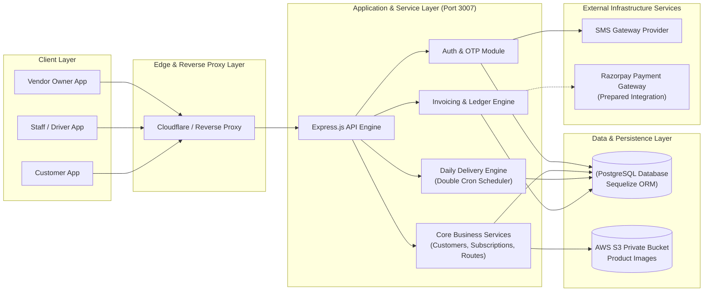

**Diagram Status:** Confirmed  
**Evidence:** `Frontend/src/services/api.js`, `backend/src/app.js`, `backend/src/server.js`, `backend/src/config/db.js`, `backend/Dockerfile`

---

## 2.4 Component Architecture

The component architecture details the logical subsystems within both the React Native Frontend and the Node.js Express Backend.

```mermaid
flowchart TB
    subgraph FRONTEND["React Native Mobile Application"]
        NAV["Root Navigator\n(AuthStack, MainDrawer, MainTabs)"]
        CTX["Context Layer\n(AuthContext, AlertContext)"]
        SCREENS["UI Screens\n(Auth, Customers, Routes, Products, Subscriptions, Deliveries, Invoices)"]
        APISERVICE["API Client Service\n(api.js with Fetch & Logging)"]

        NAV --> CTX
        CTX --> SCREENS
        SCREENS --> APISERVICE
    end

    subgraph BACKEND["Express.js Backend Application"]
        subgraph MIDDLEWARES["Middleware Processing Pipeline"]
            HELMET["Helmet Security Headers"]
            CORS["CORS Policy Guard"]
            RATELIMIT["IP Rate Limiter (5 req / 15m)"]
            AUTHMID["JWT Authenticate Middleware"]
            ROLEMID["RBAC Guard (isVendorOwner)"]
            MULTER["Multer Memory Buffer"]
        end

        subgraph CONTROLLERS["API Controllers"]
            AUTHCTRL["Auth Controller"]
            VENDCTRL["Vendor Controller"]
            CUSTCTRL["Customer Controller"]
            PRODCTRL["Product Controller"]
            ROUTCTRL["Route Controller"]
            SUBCTRL["Subscription Controller"]
            DELCTRL["Delivery Controller"]
            INVCTRL["Invoice Controller"]
            LEDGCTRL["Ledger & Deposit Controller"]
        end

        subgraph SERVICES["Business Logic & Jobs"]
            DELGEN["Delivery Generator Service"]
            CRONJOB["Delivery Cron Schedules\n(8:00 PM & 2:00 AM)"]
            S3SERV["S3 Storage Service"]
            OTPSERV["OTP Helper Service"]
        end

        subgraph DATAACCESS["Data Access Layer"]
            MODELS["Sequelize Models (26 Tables)"]
            DBINIT["Database Connection Pool"]
        end

        MIDDLEWARES --> CONTROLLERS
        CONTROLLERS --> SERVICES
        SERVICES --> DATAACCESS
        CONTROLLERS --> DATAACCESS
    end

    APISERVICE --> MIDDLEWARES
```

**Diagram Status:** Confirmed  
**Evidence:** Directory structures `Frontend/src/` and `backend/src/` (controllers, routes, middlewares, services, models, jobs)

---

## 2.5 Infrastructure Architecture

The infrastructure stack is containerized using Docker with PM2 managing application execution on port 3007, communicating with a managed PostgreSQL instance and AWS S3 bucket over TLS/SSL connections.

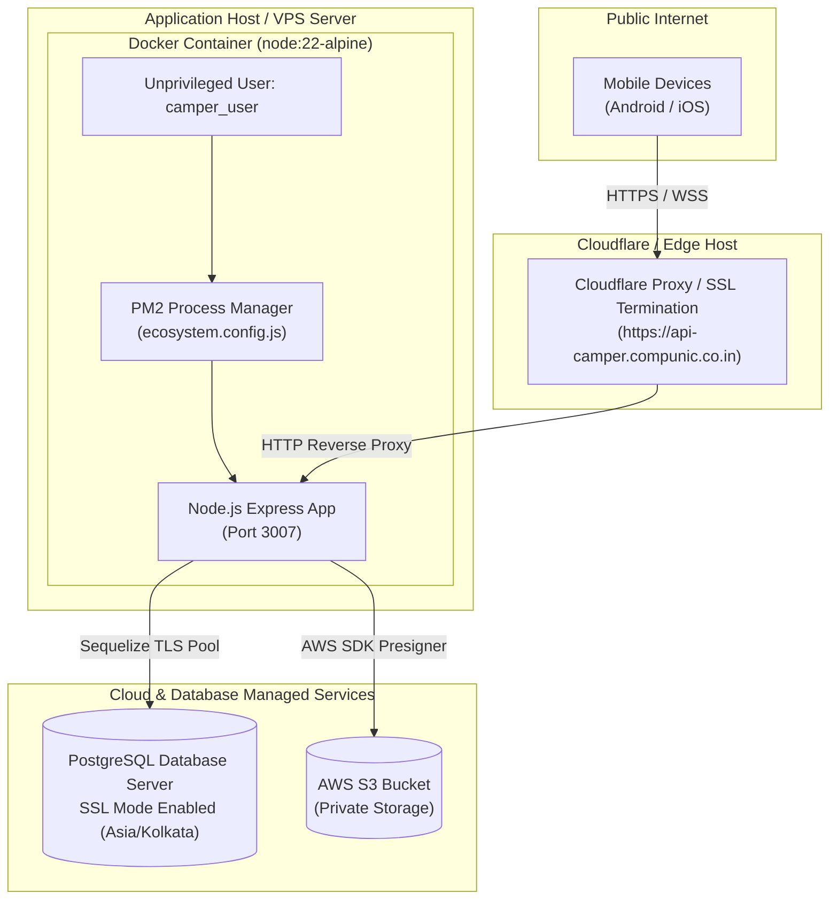

**Diagram Status:** Confirmed  
**Evidence:** `backend/Dockerfile`, `backend/ecosystem.config.js`, `backend/src/config/db.js`, `backend/src/app.js`

---

## 2.6 Data Flow Diagram — DFD

### Level 0 System DFD
The Level-0 diagram represents high-level data interactions between external entities (Vendor Owner, Driver, Customer), the Camper Core System, and external stores/services.

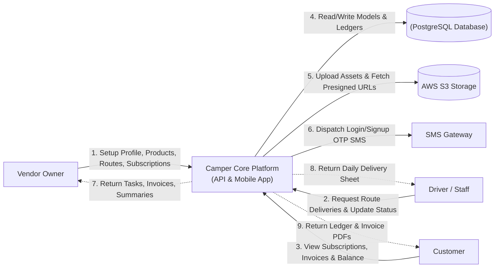

### Level 1 Subsystem DFD (Deliveries & Billing Pipeline)
The Level-1 diagram details how long-term Subscriptions are transformed into Daily Deliveries, processed by drivers, converted into Invoices, and recorded in Customer Ledgers.

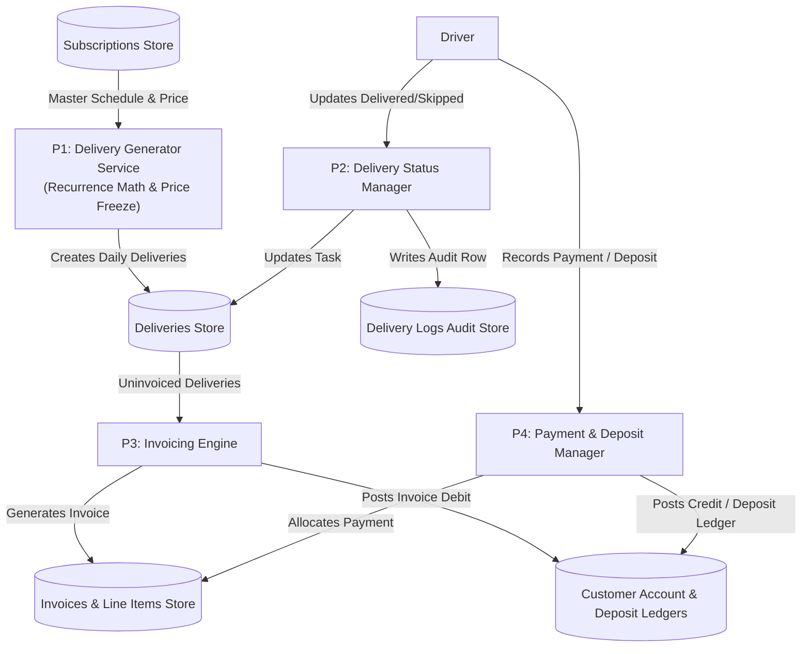

**Diagram Status:** Confirmed  
**Evidence:** `backend/src/services/delivery-generator.service.js`, `backend/src/controllers/delivery.controller.js`, `backend/src/controllers/invoice.controller.js`, `backend/src/controllers/ledger.controller.js`

---

## 2.7 Major Business Flow Sequence Diagrams

### Flow 1: OTP Context ID Authentication & Registration Flow

**Purpose:** Demonstrates the secure passwordless login and vendor registration sequence using session Context IDs.  
**Actors / Components:** Client App, Auth Controller, OtpLog DB Table, SMS Helper Service, User & Vendor DB Tables.

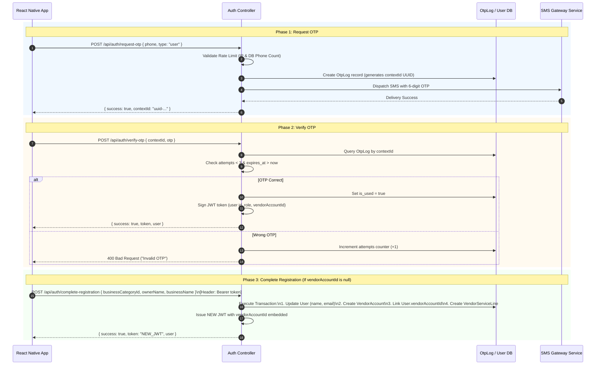

**Evidence:** `backend/src/controllers/auth.controller.js`, `backend/memoryBank/auth.md`

---

### Flow 2: Daily Delivery Generator Engine Flow (Cron & Idempotency)

**Purpose:** Shows how daily delivery tasks are automatically evaluated and generated with frozen pricing.  
**Actors / Components:** Cron Trigger / Vendor, Delivery Controller, Generator Service, Subscription DB, Delivery DB, DeliveryLog DB.

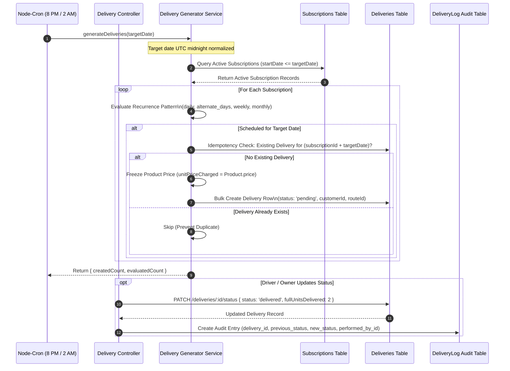

**Evidence:** `backend/src/jobs/delivery.cron.js`, `backend/src/services/delivery-generator.service.js`, `backend/src/controllers/delivery.controller.js`

---

### Flow 3: Product Catalog & AWS S3 Presigned URL Flow

**Purpose:** Explains memory-buffered image uploads to AWS S3 and dynamic 2-hour presigned URL generation during API reads.  
**Actors / Components:** Client App, Multer Middleware, Product Controller, S3 Service, AWS S3 Bucket, Product DB.

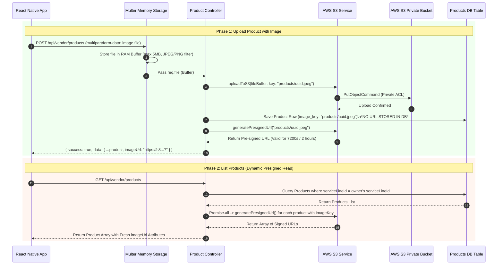

**Evidence:** `backend/src/controllers/product.controller.js`, `backend/src/services/s3.service.js`, `backend/memoryBank/product.md`

---

### Flow 4: Invoice Generation & Customer Payment Allocation Flow

**Purpose:** Details how uninvoiced deliveries are compiled into invoices and settled against customer payments.  
**Actors / Components:** Vendor Owner, Invoice Controller, Ledger Controller, Deliveries DB, Invoice DB, Customer Ledger DB.

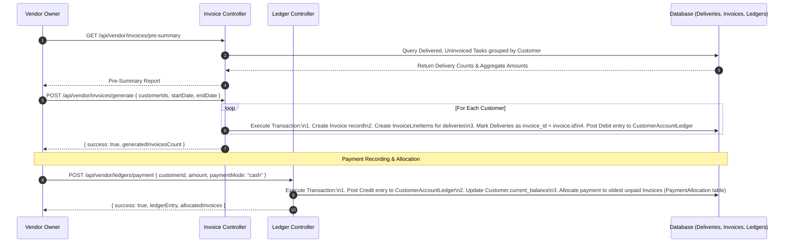

**Evidence:** `backend/src/controllers/invoice.controller.js`, `backend/src/controllers/ledger.controller.js`, `backend/src/models/`

---

### Flow 5: Route Logistics & Driver Staff Assignment Flow

**Purpose:** Explains route zone management and staff assignment auditing using effective date ranges.  
**Actors / Components:** Vendor Owner, Route Controller, StaffRoute DB Table, User DB Table.

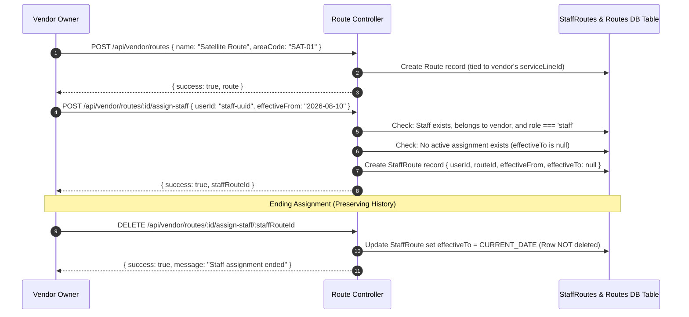

**Evidence:** `backend/src/controllers/route.controller.js`, `backend/src/models/StaffRoute.js`, `backend/memoryBank/route.md`

---

## 2.8 Deployment Architecture

The application is deployed using Docker containerization managed by PM2 on a Linux application server, fronted by a reverse proxy handling SSL termination.

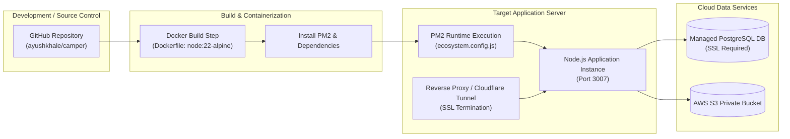

**Diagram Status:** Confirmed  
**Evidence:** `backend/Dockerfile`, `backend/ecosystem.config.js`, `backend/src/app.js`

---

## 2.9 Network Architecture

The network architecture delineates public entry boundaries, reverse proxy routing, internal application container networks, and secure cloud database/storage connections.

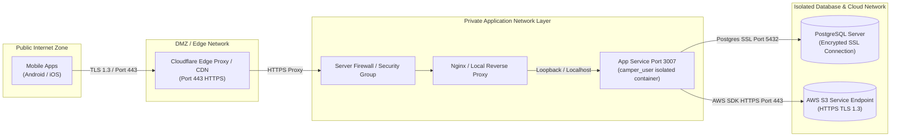

**Diagram Status:** Repository Confirmed (Logical Communication Patterns)  
**Evidence:** `backend/src/app.js` (`trust proxy 1`), `backend/src/config/db.js` (`ssl: { require: true, rejectUnauthorized: false }`)

---

## 2.10 External Integrations

| Integration | Purpose | Direction | Protocol / API | Authentication | Status |
| --- | --- | --- | --- | --- | --- |
| **AWS S3** | Private product image storage & presigned URL delivery | Bi-directional | HTTPS / AWS SDK v3 | AWS Access Key & Secret | Confirmed |
| **SMS Gateway Provider** | OTP SMS delivery for user/customer auth | Outbound | HTTPS / REST API | API Key / Bearer Token | Confirmed (Abstracted) |
| **Razorpay** | Online payment collection and webhooks | Inbound / Outbound | HTTPS / Webhooks | Razorpay Key Secret & Signature Verification | Partial (Prepared in `app.js`) |
| **Cloudflare** | Edge SSL termination & Cloudflare Tunnel proxy | Inbound | HTTPS / Tunnel Protocol | Cloudflare Token | Confirmed |

---

## 2.11 Third-Party Services

| Service | Provider | Purpose | Configuration Evidence | Criticality |
| --- | --- | --- | --- | --- |
| **AWS S3** | Amazon Web Services | Private file storage for product images | `@aws-sdk/client-s3` in `package.json` | High |
| **PostgreSQL** | Managed Database Host | Relational data persistence & transactional accounting | `pg` dependency in `package.json` | Critical |
| **Cloudflare** | Cloudflare Inc. | SSL termination and CDN tunneling | CORS allowed origins in `src/app.js` | Medium |

---

## 2.12 Authentication and Authorization Architecture

### Authentication Mechanism
Authentication is entirely **passwordless and OTP-driven** using a session-bound **Context ID architecture**:
1. Requesting an OTP creates a UUID record in `otp_logs`, which is returned as `contextId`.
2. The user submits `{ contextId, otp }` to verify. The backend looks up the record by primary key (`contextId`), checking expiration (10 min) and wrong guess attempts (max 3).
3. Verification issues a signed JWT token containing `{ id, role, vendorAccountId }`.

### Authorization Mechanism (RBAC)
Role-Based Access Control is enforced by middleware guards:
* `authenticate`: Verifies JWT signature and attaches decoded user payload to `req.user`.
* `isVendorOwner`: Checks `req.user.role === 'owner'`. Returns `403 Forbidden` if violated.
* Service Line & Vendor Isolation: Controllers resolve `vendorAccountId` from `req.user` and apply `where: { serviceLineId }` or `where: { vendorAccountId }` on all Sequelize queries.

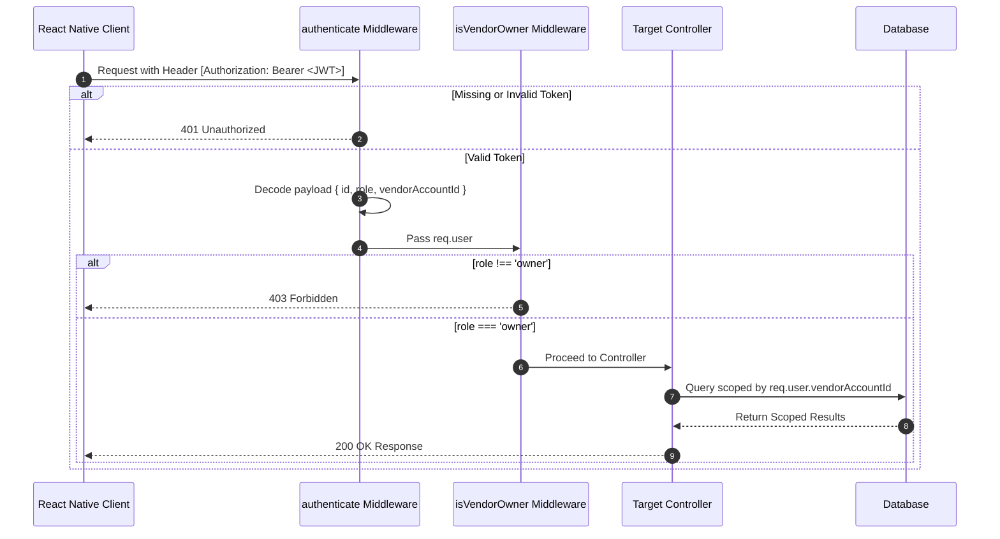

**Evidence:** `backend/src/middlewares/auth.middleware.js`, `backend/src/middlewares/role.middleware.js`, `backend/memoryBank/auth.md`

---

## 2.13 File Storage Architecture

File storage is dedicated to product images using a secure S3 presigned URL pattern.

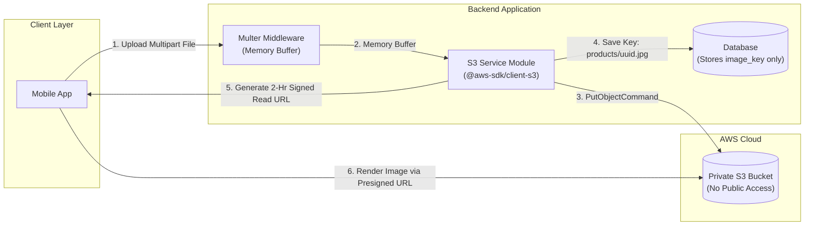

**Evidence:** `backend/src/services/s3.service.js`, `backend/src/controllers/product.controller.js`

---

## 2.14 Caching Architecture

`No dedicated application caching architecture was identified in the repository.`

* **Analysis Finding:** No Redis, Memcached, or external memory-cache dependencies exist in `package.json`. Data queries read directly from PostgreSQL via Sequelize.

---

## 2.15 Logging Architecture

Logging is handled via HTTP request logging using `morgan` with a custom body serializer and structured `console.log` / `console.error` stdout statements.

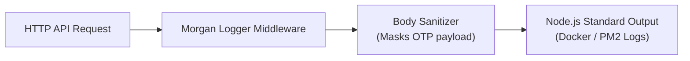

**Evidence:** `backend/src/app.js` (lines 64–77: custom Morgan body token masking `otp`).

---

## 2.16 Monitoring Architecture

`No dedicated application monitoring platform was identified from current project files.`

* **Analysis Finding:** No Prometheus, Grafana, Sentry, Datadog, or CloudWatch SDK integrations were found in the codebase. Process monitoring is handled locally via PM2.

---

## 2.17 Logging and Monitoring Combined View

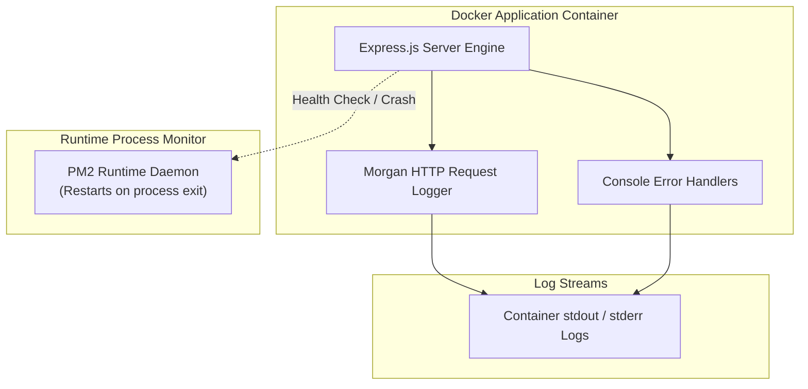

---

## 2.18 Architecture Data Paths

| Flow | Source | Destination | Data | Mechanism |
| --- | --- | --- | --- | --- |
| **Authentication** | Mobile Client | Auth Controller | Phone, OTP, Context ID | HTTP POST / JSON |
| **Product Upload** | Mobile Client | AWS S3 Bucket | Product Image Buffer | HTTP Multipart / S3 SDK PutObject |
| **Presigned URL Read** | Product Controller | Mobile Client | 2-Hour Presigned HTTPS URL | GetObjectCommand Presigner |
| **Delivery Generation** | Cron Job / Service | Deliveries DB Table | Daily Delivery Tasks & Prices | Sequelize Bulk Create |
| **Delivery Audit** | Delivery Controller | DeliveryLog DB Table | Status Transitions & Actor ID | Synchronous DB Insert |
| **Invoice Posting** | Invoice Controller | Account Ledger DB Table | Uninvoiced Deliveries Debit | Transactional DB Insert |
| **Payment Allocation** | Ledger Controller | PaymentAllocation Table | Payment Credit & Invoice IDs | Transactional Allocation |

---

## 2.19 Architectural Patterns Identified

### 1. Layered Architecture (MVC / Service-Controller-Model)
* **Status:** Confirmed
* **Evidence:** Clear segregation into `routes/`, `controllers/`, `services/`, `models/`, `middlewares/`, `validations/`.
* **Implication:** High maintainability and separation of concerns.

### 2. Multi-Tenant Data Isolation Pattern
* **Status:** Confirmed
* **Evidence:** Every business entity belongs to a `vendor_service_line` or `vendor_account_id`. Controllers enforce JWT-based scoping on all queries.
* **Implication:** Complete data privacy between competing vendors.

### 3. Presigned Asset Access Pattern (AWS S3)
* **Status:** Confirmed
* **Evidence:** `s3.service.js` generates time-limited presigned URLs on every read; database stores key only.
* **Implication:** Prevents public bucket exposure and eliminates proxy server bandwidth bottlenecks.

### 4. Idempotent Task Generator Pattern
* **Status:** Confirmed
* **Evidence:** `delivery-generator.service.js` checks existing delivery records for `(subscriptionId + targetDate)` before bulk inserting.
* **Implication:** Cron jobs can run multiple times safely without generating duplicate deliveries.

### 5. Context ID Session OTP Pattern
* **Status:** Confirmed
* **Evidence:** `OtpLog` creates a unique primary key `contextId` per OTP request, which must be presented during verification.
* **Implication:** Eliminates phone-number race conditions and prevents brute-force attempts.

---

## 2.20 Architecture Risks / Gaps

1. **Single Database Node Dependency:**
   * *Evidence:* `src/config/db.js` connects to a single PostgreSQL host. No read-replicas or failover clusters configured.
2. **Absence of Dedicated Caching Layer:**
   * *Evidence:* Product catalog reads and delivery lists hit PostgreSQL directly on every request. High traffic may increase DB CPU usage.
3. **Absence of APM & Error Tracking:**
   * *Evidence:* No Sentry or Datadog integrations. Unhandled exceptions rely solely on PM2 stdout logs.
4. **Abstracted SMS Provider Setup:**
   * *Evidence:* `otp.helper.service.js` uses abstract logging; production SMS gateway requires environment verification.
5. **Commented Webhook Endpoint:**
   * *Evidence:* Razorpay webhook parser is commented out in `src/app.js`, requiring manual payment recording until activated.

---

## 2.21 Architecture Confirmation Requirements

1. Production database hosting topology (Single instance vs. Managed Multi-AZ failover).
2. Production SMS Gateway provider credentials and template IDs.
3. Production server firewall rules and reverse proxy SSL certificate setup.
4. Database backup, point-in-time recovery, and snapshot retention schedule.
5. Target APM or centralized log aggregation platform selection (e.g., Datadog, Sentry, ELK).

---

## 2.22 Architecture Evidence Matrix

| Architecture Area | Evidence File / Folder | Finding |
| --- | --- | --- |
| **Frontend Mobile** | `Frontend/package.json`, `Frontend/src/` | React Native 0.86.0, React Navigation 7, AsyncStorage, i18next, PDF print modules. |
| **Backend API Core** | `backend/package.json`, `backend/src/app.js` | Express 5.2.1, Helmet, Cors, Express Rate Limit, BodyParser, Morgan. |
| **Database Architecture** | `backend/src/config/db.js`, `backend/src/models/` | PostgreSQL with SSL, 26 Sequelize models, soft deletes (`deleted_at`), timezone +05:30. |
| **Authentication & AuthZ** | `backend/src/controllers/auth.controller.js`, `middlewares/` | Context ID OTP verification (`OtpLog`), JWT generation, `isVendorOwner` RBAC guard. |
| **Asset Storage** | `backend/src/services/s3.service.js`, `controllers/product.controller.js` | AWS S3 memory buffer upload, 2-hour presigned URLs, S3 object deletion on product update/delete. |
| **Delivery Engine** | `backend/src/services/delivery-generator.service.js`, `jobs/delivery.cron.js` | Idempotent generation engine, 8 PM & 2 AM crons, price freezing, `DeliveryLog` audit logging. |
| **Invoicing & Ledgers** | `backend/src/controllers/invoice.controller.js`, `ledger.controller.js` | Uninvoiced summaries, batch generation, PDF exports, running balances, payment allocations. |
| **Deployment Setup** | `backend/Dockerfile`, `backend/ecosystem.config.js` | Node 22 Alpine image, non-root `camper_user`, PM2 cluster runtime on port 3007. |

---

## 2.23 Mermaid Diagram Index

| Diagram ID | Diagram Name | Mermaid Type | Status |
| --- | --- | --- | --- |
| **ARCH-01** | High-Level System Architecture | `flowchart LR` | Repository Confirmed |
| **ARCH-02** | Layered Component Architecture | `flowchart TB` | Repository Confirmed |
| **ARCH-03** | Infrastructure & Container Stack | `flowchart TB` | Repository Confirmed |
| **ARCH-04** | Level 0 System Data Flow Diagram (DFD) | `flowchart LR` | Repository Confirmed |
| **ARCH-05** | Level 1 Deliveries & Billing Subsystem DFD | `flowchart TB` | Repository Confirmed |
| **ARCH-06** | OTP Context ID Auth & Registration Flow | `sequenceDiagram` | Repository Confirmed |
| **ARCH-07** | Daily Delivery Generator Engine Flow | `sequenceDiagram` | Repository Confirmed |
| **ARCH-08** | Product Catalog & AWS S3 Presigned URL Flow | `sequenceDiagram` | Repository Confirmed |
| **ARCH-09** | Invoice Generation & Payment Allocation Flow | `sequenceDiagram` | Repository Confirmed |
| **ARCH-10** | Route Logistics & Staff Assignment Flow | `sequenceDiagram` | Repository Confirmed |
| **ARCH-11** | Deployment Architecture Pipeline | `flowchart LR` | Repository Confirmed |
| **ARCH-12** | Network Topology & Security Boundaries | `flowchart LR` | Repository Confirmed |
| **ARCH-13** | RBAC Authorization Verification Sequence | `sequenceDiagram` | Repository Confirmed |
| **ARCH-14** | S3 Private File Storage Architecture | `flowchart LR` | Repository Confirmed |
| **ARCH-15** | Request Logging & Sanitization Flow | `flowchart LR` | Repository Confirmed |
| **ARCH-16** | Consolidated Logging & Runtime Observability | `flowchart TB` | Repository Confirmed |
