# PART 3 — FUNCTIONAL MODULE DOCUMENTATION SOURCE

## Metadata

**Source:** Current Project Repository (`c:\Camper` workspace containing `/Frontend` and `/backend`)  
**Document Part:** 3 — Functional Module Documentation  
**Analysis Type:** Repository-Based Functional Analysis  
**Generated Date:** August 10, 2026  
**Functional Status:** Repository Validated / Complete  

---

# Master Functional Module Inventory

| Module ID | Module Name | Functional Area | Primary Users | Status | Main Evidence |
| --- | --- | --- | --- | --- | --- |
| **MOD-01** | Authentication & Vendor Onboarding | Identity & Access | Vendor Owner, Staff, Customer | Confirmed | `Screens/Auth/`, `controllers/auth.controller.js`, `models/OtpLog.js` |
| **MOD-02** | Dashboard & Overview Analytics | Reporting & Navigation | Vendor Owner | Confirmed | `Screens/Main/HomeScreen.jsx`, `controllers/vendor.controller.js` |
| **MOD-03** | Customer Management | Master Data Operations | Vendor Owner, Staff | Confirmed | `Screens/Main/Customer*.jsx`, `controllers/customer.controller.js`, `models/Customer.js` |
| **MOD-04** | Product & SKU Catalog Management | Inventory & Catalog | Vendor Owner | Confirmed | `Screens/Main/Product*.jsx`, `controllers/product.controller.js`, `services/s3.service.js` |
| **MOD-05** | Route Logistics & Staff Assignment | Field Logistics | Vendor Owner | Confirmed | `Screens/Main/Route*.jsx`, `controllers/route.controller.js`, `models/StaffRoute.js` |
| **MOD-06** | Subscription Engine | Recurring Order Rules | Vendor Owner | Confirmed | `Screens/Main/Subscription*.jsx`, `controllers/subscription.controller.js`, `models/Subscription.js` |
| **MOD-07** | Daily Deliveries Engine | Field Execution & Tasks | Vendor Owner, Staff | Confirmed | `Screens/Main/OrdersScreen.jsx`, `services/delivery-generator.service.js`, `jobs/delivery.cron.js` |
| **MOD-08** | One-Time Orders | Ad-hoc Sales | Vendor Owner, Staff | Confirmed | `Screens/Main/OneTimeOrder*.jsx`, `controllers/one-time-order.controller.js` |
| **MOD-09** | Invoicing & Billing | Financial Billing | Vendor Owner | Confirmed | `Screens/Main/Invoice*.jsx`, `controllers/invoice.controller.js`, `models/Invoice.js` |
| **MOD-10** | Financial Ledgers & Deposit Management | Accounting & Deposits | Vendor Owner | Confirmed | `Screens/Main/PaymentsScreen.jsx`, `controllers/ledger.controller.js`, `controllers/deposit.controller.js` |
| **MOD-11** | Staff Management | Human Resources & Access | Vendor Owner | Confirmed | `Screens/Main/Staff*.jsx`, `controllers/staff.controller.js`, `models/User.js` |
| **MOD-12** | System Settings & Profile | Configuration | Vendor Owner | Confirmed | `Screens/Main/SettingsScreen.jsx`, `Screens/Main/ProfileScreen.jsx`, `controllers/vendor.controller.js` |

---

# Master Screen Inventory

| Screen ID | Screen Name | Module | Route / Navigation | Source File | Primary Role |
| --- | --- | --- | --- | --- | --- |
| **SCR-001** | Login Screen | MOD-01 | `Login` | `Screens/Auth/LoginScreen.jsx` | All Users |
| **SCR-002** | OTP Verification Screen | MOD-01 | `OtpVerification` | `Screens/Auth/OtpVerificationScreen.jsx` | All Users |
| **SCR-003** | Register Screen | MOD-01 | `Register` | `Screens/Auth/RegisterScreen.jsx` | Vendor Owner |
| **SCR-004** | Complete Registration Screen | MOD-01 | `CompleteRegistration` | `Screens/Auth/CompleteRegistrationScreen.jsx` | Vendor Owner |
| **SCR-005** | Home Dashboard Screen | MOD-02 | `HomeTab` / `MainDrawer` | `Screens/Main/HomeScreen.jsx` | Vendor Owner |
| **SCR-006** | Customer List Screen | MOD-03 | `CustomerList` | `Screens/Main/CustomerListScreen.jsx` | Vendor Owner, Staff |
| **SCR-007** | Customer Detail Screen | MOD-03 | `CustomerDetail` | `Screens/Main/CustomerDetailScreen.jsx` | Vendor Owner |
| **SCR-008** | Add / Edit Customer Screen | MOD-03 | `AddCustomer` | `Screens/Main/AddCustomerScreen.jsx` | Vendor Owner |
| **SCR-009** | Customer History Screen | MOD-03 | `CustomerHistory` | `Screens/Main/CustomerHistoryScreen.jsx` | Vendor Owner |
| **SCR-010** | Customer Delivery History Screen | MOD-03 | `CustomerDeliveryHistory` | `Screens/Main/CustomerDeliveryHistoryScreen.jsx` | Vendor Owner |
| **SCR-011** | Product Catalog Screen | MOD-04 | `ProductCatalog` | `Screens/Main/ProductCatalogScreen.jsx` | Vendor Owner |
| **SCR-012** | Product Detail Screen | MOD-04 | `ProductDetail` | `Screens/Main/ProductDetailScreen.jsx` | Vendor Owner |
| **SCR-013** | Add / Edit Product Screen | MOD-04 | `AddProduct` | `Screens/Main/AddProductScreen.jsx` | Vendor Owner |
| **SCR-014** | Route List Screen | MOD-05 | `RouteList` | `Screens/Main/RouteListScreen.jsx` | Vendor Owner |
| **SCR-015** | Route Detail Screen | MOD-05 | `RouteDetail` | `Screens/Main/RouteDetailScreen.jsx` | Vendor Owner |
| **SCR-016** | Add / Edit Route Screen | MOD-05 | `AddRoute` | `Screens/Main/AddRouteScreen.jsx` | Vendor Owner |
| **SCR-017** | Route Builder & Sequence Screen | MOD-05 | `RouteBuilder` | `Screens/Main/RouteBuilderScreen.jsx` | Vendor Owner |
| **SCR-018** | Subscription List Screen | MOD-06 | `SubscriptionList` | `Screens/Main/SubscriptionListScreen.jsx` | Vendor Owner |
| **SCR-019** | Subscription Detail Screen | MOD-06 | `SubscriptionDetail` | `Screens/Main/SubscriptionDetailScreen.jsx` | Vendor Owner |
| **SCR-020** | Add / Edit Subscription Screen | MOD-06 | `AddSubscription` | `Screens/Main/AddSubscriptionScreen.jsx` | Vendor Owner |
| **SCR-021** | Daily Deliveries (Orders) Screen | MOD-07 | `OrdersTab` | `Screens/Main/OrdersScreen.jsx` | Vendor Owner, Staff |
| **SCR-022** | Past Deliveries Screen | MOD-07 | `PastDeliveries` | `Screens/Main/PastDeliveriesScreen.jsx` | Vendor Owner |
| **SCR-023** | Unbilled Deliveries Screen | MOD-07 | `UnbilledDeliveries` | `Screens/Main/UnbilledDeliveriesScreen.jsx` | Vendor Owner |
| **SCR-024** | One-Time Orders List Screen | MOD-08 | `OneTimeOrderList` | `Screens/Main/OneTimeOrderListScreen.jsx` | Vendor Owner, Staff |
| **SCR-025** | Add One-Time Order Screen | MOD-08 | `AddOneTimeOrder` | `Screens/Main/AddOneTimeOrderScreen.jsx` | Vendor Owner, Staff |
| **SCR-026** | Invoice List Screen | MOD-09 | `InvoiceList` | `Screens/Main/InvoiceListScreen.jsx` | Vendor Owner |
| **SCR-027** | Invoice Detail Screen | MOD-09 | `InvoiceDetail` | `Screens/Main/InvoiceDetailScreen.jsx` | Vendor Owner |
| **SCR-028** | Generate Invoice Screen | MOD-09 | `GenerateInvoice` | `Screens/Main/GenerateInvoiceScreen.jsx` | Vendor Owner |
| **SCR-029** | Payments & Ledgers Screen | MOD-10 | `PaymentsTab` | `Screens/Main/PaymentsScreen.jsx` | Vendor Owner |
| **SCR-030** | Staff Management Screen | MOD-11 | `StaffManagement` | `Screens/Main/StaffManagementScreen.jsx` | Vendor Owner |
| **SCR-031** | Add / Edit Staff Screen | MOD-11 | `AddStaff` | `Screens/Main/AddStaffScreen.jsx` | Vendor Owner |
| **SCR-032** | User Profile Screen | MOD-12 | `Profile` | `Screens/Main/ProfileScreen.jsx` | Vendor Owner |
| **SCR-033** | System Settings Screen | MOD-12 | `Settings` | `Screens/Main/SettingsScreen.jsx` | Vendor Owner |

---

# 3. Functional Modules

## 3.1 MOD-01: Authentication & Vendor Onboarding

### Module Metadata
* **Module ID:** MOD-01
* **Module Name:** Authentication & Vendor Onboarding
* **Functional Area:** Identity & Access Management
* **Primary User Roles:** Vendor Owner, Staff, Customer
* **Module Status:** Confirmed

### 3.1.1 Purpose
The Authentication & Vendor Onboarding module provides passwordless, OTP-based access control and multi-tenant business setup. It enables users to request and verify SMS OTPs securely via a Context ID session architecture. New vendor owners complete a multi-step registration flow that Provisions their business account, links their initial business service line (e.g. Water Camper Delivery), and issues scoped JWT authentication tokens.

### 3.1.2 Features
* Passwordless SMS OTP Login for Owners, Staff, and Customers.
* Context ID session tracking to eliminate phone-number brute force and race conditions.
* Business Category picker loaded dynamically from backend (`WATER_CAMPER`, etc.).
* Vendor Account creation paired with Vendor Service Line initialization in a database transaction.
* Resend OTP handling with explicit counter limits (max 3 resends).
* Session restoration and JWT persistence via React Native `AsyncStorage`.

### 3.1.3 User Roles
| User Role | Access / Responsibility | Permission Evidence |
| --- | --- | --- |
| **Vendor Owner** | Full signup, OTP verification, complete registration, login | `role: 'owner'` check in `auth.controller.js` |
| **Staff** | OTP login using phone provisioned by owner | `role: 'staff'` check in `auth.controller.js` |
| **Customer** | OTP login using phone assigned by vendor | `type: 'customer'` in `auth.controller.js` |

### 3.1.4 Main Screens
| Screen ID | Screen Name | Purpose | Route / Navigation | Source Evidence |
| --- | --- | --- | --- | --- |
| **SCR-001** | Login Screen | Enter phone number and trigger login OTP | `Login` | `Screens/Auth/LoginScreen.jsx` |
| **SCR-002** | OTP Verification Screen | Enter 6-digit OTP code bound to contextId | `OtpVerification` | `Screens/Auth/OtpVerificationScreen.jsx` |
| **SCR-003** | Register Screen | Vendor phone registration for new accounts | `Register` | `Screens/Auth/RegisterScreen.jsx` |
| **SCR-004** | Complete Registration Screen | Enter owner name, business name, and select category | `CompleteRegistration` | `Screens/Auth/CompleteRegistrationScreen.jsx` |

### 3.1.5 Navigation Flow
Users enter the app via the Login Screen or Register Screen. Submitting a valid phone number transitions to the OTP Verification Screen. Successful verification for an established user navigates to the Home Dashboard, while a new owner with an incomplete account is routed to Complete Registration.

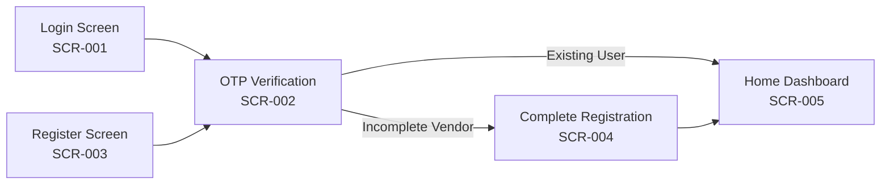
**Diagram Status:** Confirmed

### 3.1.6 Database Tables Used
| Table / Entity | Usage | Access Type | Evidence |
| --- | --- | --- | --- |
| `users` | Store user profiles, roles, and vendorAccountId link | Read / Write | `models/User.js` |
| `otp_logs` | Store OTP codes, expiration, attempts, resend count, contextId | Read / Write | `models/OtpLog.js` |
| `vendor_accounts` | Vendor business master record | Write | `models/VendorAccount.js` |
| `vendor_service_lines` | Link vendor account to business category | Write | `models/VendorServiceLine.js` |
| `business_categories` | Reference list of available industry categories | Read | `models/BusinessCategory.js` |

### 3.1.7 APIs Used
| Method | Endpoint | Purpose | Authentication | Handler / Service |
| --- | --- | --- | --- | --- |
| `GET` | `/api/public/categories` | Fetch active business categories | Public | `auth.controller.js:getCategories` |
| `POST` | `/api/auth/request-otp` | Request login OTP | Public (Rate-Limited) | `auth.controller.js:requestOtp` |
| `POST` | `/api/auth/resend-otp` | Resend OTP code | Public (Rate-Limited) | `auth.controller.js:resendOtp` |
| `POST` | `/api/auth/verify-otp` | Verify OTP code & return JWT | Public | `auth.controller.js:verifyOtp` |
| `POST` | `/api/auth/signup-request-otp` | Request signup OTP for new vendor | Public (Rate-Limited) | `auth.controller.js:signupRequestOtp` |
| `POST` | `/api/auth/signup-verify-otp` | Verify signup OTP & create stub user | Public | `auth.controller.js:signupVerifyOtp` |
| `POST` | `/api/auth/complete-registration` | Complete vendor profile setup | Protected (Bearer JWT) | `auth.controller.js:completeRegistration` |

### 3.1.8 Validation Rules
#### Frontend Validation
* Phone number must contain valid digits (10–12 digits).
* OTP must be exactly 6 numeric digits.
* Business Category selection is required before submitting Complete Registration.

#### Backend Validation
* Joi schema enforces phone format, contextId UUID format, and non-empty string fields.
* Dual rate-limiting: Max 5 OTP requests per 15 minutes per IP (`express-rate-limit`) and per phone number in DB.
* OTP expiration enforced at 10 minutes (`expires_at`).
* Maximum wrong guess limit capped at 3 attempts (`attempts`).
* Maximum resend limit capped at 3 (`resend_count`).

### 3.1.9 Business Rules
| Rule ID | Business Rule | Trigger / Condition | Outcome |
| --- | --- | --- | --- |
| **BR-MOD01-01** | Stub User Creation | `signup-verify-otp` called for new phone | Creates `User` with `role: 'owner'` and `vendorAccountId: null`. |
| **BR-MOD01-02** | Transactional Vendor Setup | `complete-registration` submitted | Transaction updates User, creates `VendorAccount` & `VendorServiceLine`, issues new JWT. |
| **BR-MOD01-03** | Context ID Security | OTP verification requested | Lookups use `contextId` primary key instead of unauthenticated phone queries. |

### 3.1.10 Reports Generated
`No module-specific report generation was identified.`

### 3.1.11 Notifications
| Event | Channel | Recipient | Trigger | Service / Evidence |
| --- | --- | --- | --- | --- |
| OTP Dispatch | SMS | User / Customer | Request or Resend OTP trigger | `services/otp.helper.service.js` |

### 3.1.12 Dependencies
* **Internal:** `src/middlewares/rateLimiter.middleware.js`, `src/middlewares/auth.middleware.js`
* **External:** SMS Gateway Provider

### 3.1.13 Error Handling
* **400 Bad Request:** Returned on incorrect OTP guess, invalid contextId, or missing required body parameters.
* **429 Too Many Requests:** Triggered when IP or phone exceeds 5 requests per 15 minutes.
* **UI Feedback:** Red error alert banners rendered via `AlertContext`.

### 3.1.14 Recommended Screenshots
| Screenshot ID | Screen | Purpose | Suggested Caption | Orientation | Priority |
| --- | --- | --- | --- | --- | --- |
| **SS-MOD01-01** | Login Screen | System entry point | Mobile Phone OTP Login Screen | Portrait | High |
| **SS-MOD01-02** | OTP Verification | OTP entry UI | 6-Digit OTP Verification Screen | Portrait | High |
| **SS-MOD01-03** | Complete Registration | Vendor onboarding UI | Business Registration Setup Screen | Portrait | High |

### 3.1.15 Module Notes / Confirmation Requirements
1. Production SMS Gateway vendor selection and SMS template approval.

---

## 3.2 MOD-02: Dashboard & Overview Analytics

### Module Metadata
* **Module ID:** MOD-02
* **Module Name:** Dashboard & Overview Analytics
* **Functional Area:** Executive & Operations Overview
* **Primary User Roles:** Vendor Owner
* **Module Status:** Confirmed

### 3.2.1 Purpose
The Dashboard module acts as the primary operational hub for Vendor Owners upon logging in. It aggregates real-time metrics across active customers, total products, active routes, daily deliveries status (delivered vs pending), unbilled items, and outstanding revenue balances, providing instant visibility into daily business operations.

### 3.2.2 Features
* Aggregate count cards for Active Customers, Products, Routes, and Active Subscriptions.
* Real-time Today's Delivery progress summary (Completed vs Pending vs Skipped).
* Quick action shortcuts for Add Customer, Add Product, Add Subscription, and Generate Invoices.
* Direct access to side drawer and bottom navigation tabs.

### 3.2.3 User Roles
| User Role | Access / Responsibility | Permission Evidence |
| --- | --- | --- |
| **Vendor Owner** | Full view of dashboard overview counts and business stats | `isVendorOwner` middleware on `/api/vendor/dashboard` |

### 3.2.4 Main Screens
| Screen ID | Screen Name | Purpose | Route / Navigation | Source Evidence |
| --- | --- | --- | --- | --- |
| **SCR-005** | Home Dashboard Screen | Display key operational metrics and quick actions | `HomeTab` / `MainDrawer` | `Screens/Main/HomeScreen.jsx` |

### 3.2.5 Navigation Flow
The Home Dashboard serves as the central hub of the application drawer and bottom navigation.

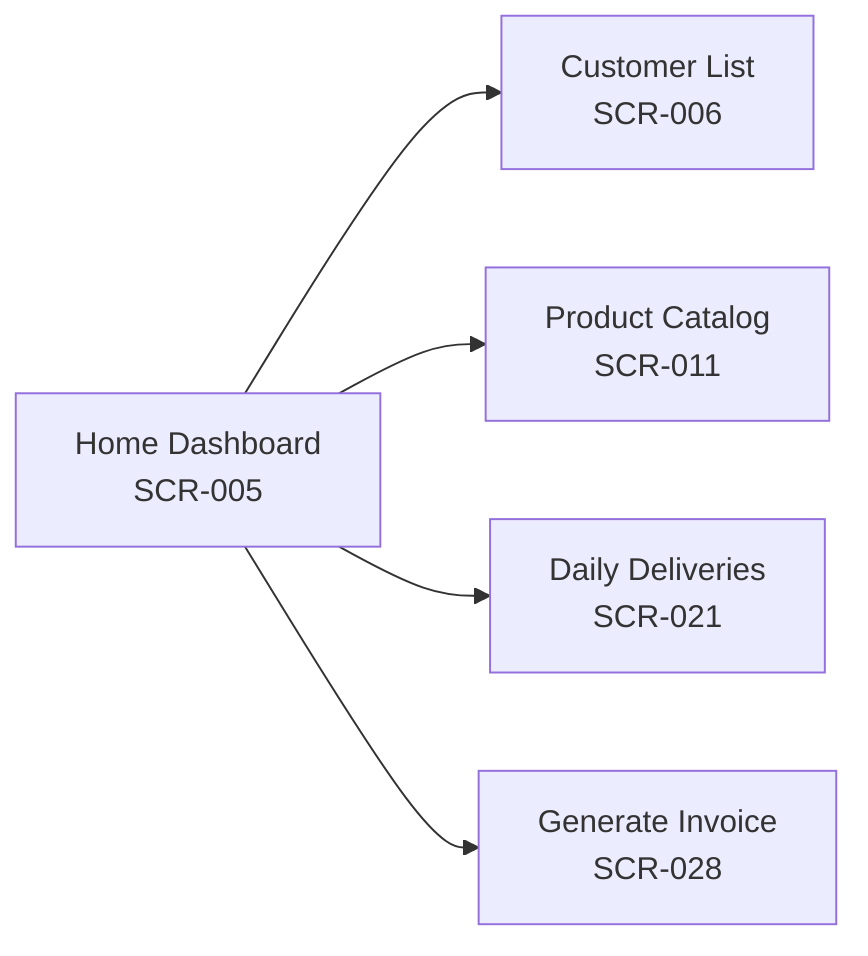
**Diagram Status:** Confirmed

### 3.2.6 Database Tables Used
| Table / Entity | Usage | Access Type | Evidence |
| --- | --- | --- | --- |
| `customers` | Count active customers for vendor service line | Read | `controllers/vendor.controller.js` |
| `products` | Count active product SKUs | Read | `controllers/vendor.controller.js` |
| `routes` | Count active delivery routes | Read | `controllers/vendor.controller.js` |
| `deliveries` | Count today's delivery status breakdown | Read | `controllers/vendor.controller.js` |

### 3.2.7 APIs Used
| Method | Endpoint | Purpose | Authentication | Handler / Service |
| --- | --- | --- | --- | --- |
| `GET` | `/api/vendor/dashboard` | Fetch summary count statistics | Protected (`isVendorOwner`) | `vendor.controller.js:getDashboardOverview` |
| `GET` | `/api/vendor/profile` | Fetch vendor account profile details | Protected (`isVendorOwner`) | `vendor.controller.js:getVendorProfile` |

### 3.2.8 Validation Rules
#### Frontend Validation
`No frontend input validation required (read-only screen).`

#### Backend Validation
* Vendor ownership validated via JWT `req.user.vendorAccountId`.

### 3.2.9 Business Rules
| Rule ID | Business Rule | Trigger / Condition | Outcome |
| --- | --- | --- | --- |
| **BR-MOD02-01** | Service Line Metric Isolation | Dashboard API call | Aggregates count metrics scoped strictly to the authenticated vendor's `serviceLineId`. |

### 3.2.10 Reports Generated
`No module-specific report generation was identified (visual metrics display only).`

### 3.2.11 Notifications
`No module-specific notification workflow identified.`

### 3.2.12 Dependencies
* **Internal:** MOD-01 Authentication, MOD-03 Customers, MOD-04 Products, MOD-05 Routes, MOD-07 Deliveries

### 3.2.13 Error Handling
* Renders skeleton pull-to-refresh loaders; displays Alert context toast on API fetch failures.

### 3.2.14 Recommended Screenshots
| Screenshot ID | Screen | Purpose | Suggested Caption | Orientation | Priority |
| --- | --- | --- | --- | --- | --- |
| **SS-MOD02-01** | Home Dashboard | Operational overview | Vendor Home Dashboard & Operational Summary | Portrait | High |

### 3.2.15 Module Notes / Confirmation Requirements
`None.`

---

## 3.3 MOD-03: Customer Management

### Module Metadata
* **Module ID:** MOD-03
* **Module Name:** Customer Management
* **Functional Area:** Master Data & Customer Operations
* **Primary User Roles:** Vendor Owner, Staff
* **Module Status:** Confirmed

### 3.3.1 Purpose
Customer Management maintains the core directory of end-clients receiving daily or on-demand deliveries. It supports customer profile creation, delivery address configuration with GPS coordinates (latitude/longitude), route assignment, sequence ordering along delivery routes, credit limit enforcement, opening balance tracking, and detailed delivery/payment historical logs.

### 3.3.2 Features
* Search customers by name or phone with instant text filtering.
* Filter customer lists by assigned delivery route.
* Capture delivery addresses with GPS location coordinates.
* Track credit limit, opening balance, and live running outstanding balance.
* Sequence order assignment for delivery route optimization.
* Soft deletion preserving subscription and financial audit histories.

### 3.3.3 User Roles
| User Role | Access / Responsibility | Permission Evidence |
| --- | --- | --- |
| **Vendor Owner** | Full CRUD access to customers and route assignments | `isVendorOwner` guard on `/api/vendor/customers` |
| **Staff** | Read customer address, phone, and delivery route info | Staff delivery view access |

### 3.3.4 Main Screens
| Screen ID | Screen Name | Purpose | Route / Navigation | Source Evidence |
| --- | --- | --- | --- | --- |
| **SCR-006** | Customer List Screen | View all customers with search and route filter | `CustomerList` | `Screens/Main/CustomerListScreen.jsx` |
| **SCR-007** | Customer Detail Screen | Detailed view of customer info, route, and balances | `CustomerDetail` | `Screens/Main/CustomerDetailScreen.jsx` |
| **SCR-008** | Add / Edit Customer Screen | Form for creating or modifying customer details | `AddCustomer` | `Screens/Main/AddCustomerScreen.jsx` |
| **SCR-009** | Customer History Screen | Transaction history log for selected customer | `CustomerHistory` | `Screens/Main/CustomerHistoryScreen.jsx` |
| **SCR-010** | Customer Delivery History | Delivery task execution history log | `CustomerDeliveryHistory` | `Screens/Main/CustomerDeliveryHistoryScreen.jsx` |

### 3.3.5 Navigation Flow
From the Customer List Screen, users can search or filter customers, add a new customer, or tap a customer card to inspect details and navigate to history views.

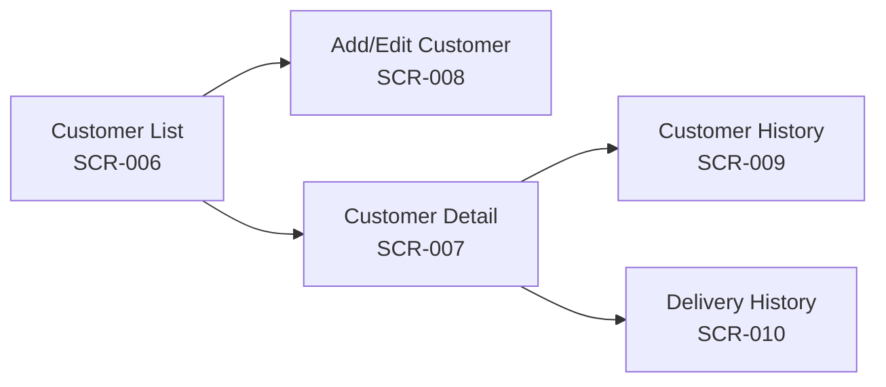
**Diagram Status:** Confirmed

### 3.3.6 Database Tables Used
| Table / Entity | Usage | Access Type | Evidence |
| --- | --- | --- | --- |
| `customers` | Master customer record | Read / Write | `models/Customer.js` |
| `routes` | Delivery route zone details | Read | `models/Route.js` |
| `vendor_service_lines` | Scoping customer to vendor service line | Read | `models/VendorServiceLine.js` |

### 3.3.7 APIs Used
| Method | Endpoint | Purpose | Authentication | Handler / Service |
| --- | --- | --- | --- | --- |
| `POST` | `/api/vendor/customers` | Create new customer | Protected (`isVendorOwner`) | `customer.controller.js:createCustomer` |
| `GET` | `/api/vendor/customers` | List customers with search/route filter | Protected (`isVendorOwner`) | `customer.controller.js:getCustomers` |
| `GET` | `/api/vendor/customers/:id` | Get single customer detail | Protected (`isVendorOwner`) | `customer.controller.js:getCustomerById` |
| `PATCH` | `/api/vendor/customers/:id` | Update customer details | Protected (`isVendorOwner`) | `customer.controller.js:updateCustomer` |
| `DELETE` | `/api/vendor/customers/:id` | Soft delete customer | Protected (`isVendorOwner`) | `customer.controller.js:deleteCustomer` |

### 3.3.8 Validation Rules
#### Frontend Validation
* Customer `name` is required.
* Phone number format validation if provided.
* Positive decimal values for `creditLimit` and `openingBalance`.

#### Backend Validation
* Joi schema enforces required `name` string (max 150 chars).
* Explicit DB check verifies that assigned `routeId` belongs to the authenticated vendor's `serviceLineId`.

### 3.3.9 Business Rules
| Rule ID | Business Rule | Trigger / Condition | Outcome |
| --- | --- | --- | --- |
| **BR-MOD03-01** | Route Service Line Guard | Assigning `routeId` to Customer | Backend validates route belongs to the owner's service line; rejects cross-vendor route assignment with HTTP 400. |
| **BR-MOD03-02** | Paranoid Soft Delete | Delete customer request | Sets `deleted_at` timestamp; preserves historical subscriptions, invoices, and ledgers intact. |

### 3.3.10 Reports Generated
`No module-specific report generation was identified.`

### 3.3.11 Notifications
`No module-specific notification workflow identified.`

### 3.3.12 Dependencies
* **Internal:** MOD-05 Route Logistics, MOD-01 Authentication

### 3.3.13 Error Handling
* Form displays inline validation messages; API returns `400 Bad Request` on invalid route assignment.

### 3.3.14 Recommended Screenshots
| Screenshot ID | Screen | Purpose | Suggested Caption | Orientation | Priority |
| --- | --- | --- | --- | --- | --- |
| **SS-MOD03-01** | Customer List | Directory view | Customer Directory & Filter Screen | Portrait | High |
| **SS-MOD03-02** | Add Customer | Form UI | Add New Customer Setup Screen | Portrait | High |
| **SS-MOD03-03** | Customer Detail | Profile view | Customer Detail & Balance Screen | Portrait | Medium |

### 3.3.15 Module Notes / Confirmation Requirements
`None.`

---

## 3.4 MOD-04: Product & SKU Catalog Management

### Module Metadata
* **Module ID:** MOD-04
* **Module Name:** Product & SKU Catalog Management
* **Functional Area:** Inventory & Product Catalog
* **Primary User Roles:** Vendor Owner
* **Module Status:** Confirmed

### 3.4.1 Purpose
The Product Catalog module manages the inventory of goods sold by the vendor (e.g. 20L Water Can, 5L Bottle). It handles SKU creation, pricing, unit assignment, returnable container deposit configuration, active/inactive status toggling, and secure AWS S3 private image storage with presigned URLs.

### 3.4.2 Features
* Product listing with dynamically generated AWS S3 presigned image thumbnails.
* Returnable container flag (`isReturnableContainer`) and deposit amount (`depositAmount`) configuration.
* Image upload with Multer memory buffer and automatic S3 key generation (`products/uuid.jpg`).
* Instant S3 object cleanup when an image is updated or a product is deleted.
* Soft deletion protecting historical subscription and invoice records.

### 3.4.3 User Roles
| User Role | Access / Responsibility | Permission Evidence |
| --- | --- | --- |
| **Vendor Owner** | Full CRUD access to products and container deposit rates | `isVendorOwner` guard on `/api/vendor/products` |

### 3.4.4 Main Screens
| Screen ID | Screen Name | Purpose | Route / Navigation | Source Evidence |
| --- | --- | --- | --- | --- |
| **SCR-011** | Product Catalog Screen | Grid/List view of all vendor products | `ProductCatalog` | `Screens/Main/ProductCatalogScreen.jsx` |
| **SCR-012** | Product Detail Screen | View product SKU specifications and image | `ProductDetail` | `Screens/Main/ProductDetailScreen.jsx` |
| **SCR-013** | Add / Edit Product Screen | Form to add or modify product & upload image | `AddProduct` | `Screens/Main/AddProductScreen.jsx` |

### 3.4.5 Navigation Flow
From the Product Catalog Screen, owners can view products, tap a product to inspect specifications, or navigate to Add Product to upload new inventory items.

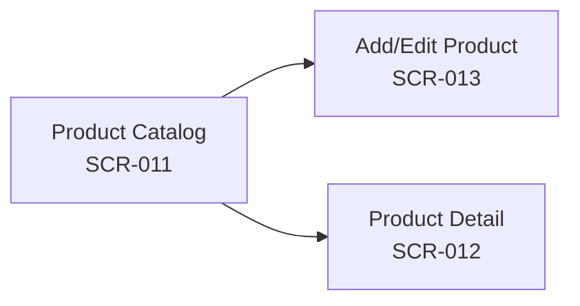
**Diagram Status:** Confirmed

### 3.4.6 Database Tables Used
| Table / Entity | Usage | Access Type | Evidence |
| --- | --- | --- | --- |
| `products` | Product master data and S3 object keys | Read / Write | `models/Product.js` |
| `vendor_service_lines` | Link products to vendor service line | Read | `models/VendorServiceLine.js` |

### 3.4.7 APIs Used
| Method | Endpoint | Purpose | Authentication | Handler / Service |
| --- | --- | --- | --- | --- |
| `POST` | `/api/vendor/products` | Create product with multipart image | Protected (`isVendorOwner`) | `product.controller.js:createProduct` |
| `GET` | `/api/vendor/products` | List products with presigned URLs | Protected (`isVendorOwner`) | `product.controller.js:getProducts` |
| `GET` | `/api/vendor/products/:id` | Get product detail | Protected (`isVendorOwner`) | `product.controller.js:getProductById` |
| `PATCH` | `/api/vendor/products/:id` | Update product details / replace image | Protected (`isVendorOwner`) | `product.controller.js:updateProduct` |
| `DELETE` | `/api/vendor/products/:id` | Delete product and S3 object | Protected (`isVendorOwner`) | `product.controller.js:deleteProduct` |

### 3.4.8 Validation Rules
#### Frontend Validation
* Product `name` and positive numeric `price` are required.
* Image file size capped at 5MB (JPEG, PNG, WebP).

#### Backend Validation
* Joi validation enforces positive decimal `price` and `depositAmount`.
* Multer memory filter enforces max 5MB size and MIME type restriction (`image/*`).

### 3.4.9 Business Rules
| Rule ID | Business Rule | Trigger / Condition | Outcome |
| --- | --- | --- | --- |
| **BR-MOD04-01** | Presigned S3 Image Delivery | Reading products via API | Generates dynamic 2-hour presigned URLs for products with an `image_key`; DB stores S3 key only. |
| **BR-MOD04-02** | S3 Asset Lifecycle Cleanup | Product deletion or image update | Calls `DeleteObjectCommand` to purge old S3 object before deleting or updating DB record. |

### 3.4.10 Reports Generated
`No module-specific report generation was identified.`

### 3.4.11 Notifications
`No module-specific notification workflow identified.`

### 3.4.12 Dependencies
* **Internal:** MOD-01 Authentication, AWS S3 Service (`src/services/s3.service.js`)
* **External:** AWS S3 Service Endpoint

### 3.4.13 Error Handling
* Returns `400 Bad Request` on non-image file uploads or negative price values.

### 3.4.14 Recommended Screenshots
| Screenshot ID | Screen | Purpose | Suggested Caption | Orientation | Priority |
| --- | --- | --- | --- | --- | --- |
| **SS-MOD04-01** | Product Catalog | Catalog grid view | Product Catalog & Inventory View | Portrait | High |
| **SS-MOD04-02** | Add Product | Add form & image picker | Product SKU Creation Screen | Portrait | High |

### 3.4.15 Module Notes / Confirmation Requirements
`None.`

---

## 3.5 MOD-05: Route Logistics & Staff Assignment

### Module Metadata
* **Module ID:** MOD-05
* **Module Name:** Route Logistics & Staff Assignment
* **Functional Area:** Route Planning & Field Operations
* **Primary User Roles:** Vendor Owner
* **Module Status:** Confirmed

### 3.5.1 Purpose
Route Logistics provides zone-based territorial management for delivery operations. Vendor Owners create delivery routes, assign area codes, re-order customer stop sequences within routes, and assign staff drivers to routes with audit-tracked start (`effectiveFrom`) and end (`effectiveTo`) date ranges.

### 3.5.2 Features
* Delivery route creation and area code tagging.
* Staff assignment with date range auditing (`effectiveFrom` / `effectiveTo`).
* Non-destructive staff unassignment (sets `effectiveTo = today` to maintain historical audit logs).
* Customer stop sequence ordering (`RouteBuilderScreen`).
* Route deletion protected via paranoid soft delete.

### 3.5.3 User Roles
| User Role | Access / Responsibility | Permission Evidence |
| --- | --- | --- |
| **Vendor Owner** | Full management of routes, sequence orders, and driver assignments | `isVendorOwner` guard on `/api/vendor/routes` |

### 3.5.4 Main Screens
| Screen ID | Screen Name | Purpose | Route / Navigation | Source Evidence |
| --- | --- | --- | --- | --- |
| **SCR-014** | Route List Screen | Overview of delivery routes and assigned staff | `RouteList` | `Screens/Main/RouteListScreen.jsx` |
| **SCR-015** | Route Detail Screen | View route stops, customers, and driver history | `RouteDetail` | `Screens/Main/RouteDetailScreen.jsx` |
| **SCR-016** | Add / Edit Route Screen | Create or modify route name and area code | `AddRoute` | `Screens/Main/AddRouteScreen.jsx` |
| **SCR-017** | Route Builder Screen | Re-order customer delivery sequence along route | `RouteBuilder` | `Screens/Main/RouteBuilderScreen.jsx` |

### 3.5.5 Navigation Flow
From the Route List Screen, owners can add routes, inspect route details, or launch the Route Builder to re-sequence customer delivery stops.

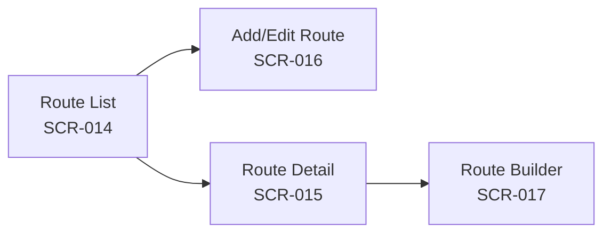
**Diagram Status:** Confirmed

### 3.5.6 Database Tables Used
| Table / Entity | Usage | Access Type | Evidence |
| --- | --- | --- | --- |
| `routes` | Master route record | Read / Write | `models/Route.js` |
| `staff_routes` | Staff route assignment with date ranges | Read / Write | `models/StaffRoute.js` |
| `customers` | Customers assigned to route | Read / Write | `models/Customer.js` |
| `users` | Driver / Staff user details | Read | `models/User.js` |

### 3.5.7 APIs Used
| Method | Endpoint | Purpose | Authentication | Handler / Service |
| --- | --- | --- | --- | --- |
| `POST` | `/api/vendor/routes` | Create delivery route | Protected (`isVendorOwner`) | `route.controller.js:createRoute` |
| `GET` | `/api/vendor/routes` | List routes with assigned staff | Protected (`isVendorOwner`) | `route.controller.js:getRoutes` |
| `GET` | `/api/vendor/routes/:id` | Get route detail | Protected (`isVendorOwner`) | `route.controller.js:getRouteById` |
| `PATCH` | `/api/vendor/routes/:id` | Update route details | Protected (`isVendorOwner`) | `route.controller.js:updateRoute` |
| `DELETE` | `/api/vendor/routes/:id` | Soft delete route | Protected (`isVendorOwner`) | `route.controller.js:deleteRoute` |
| `POST` | `/api/vendor/routes/:id/assign-staff` | Assign driver with date range | Protected (`isVendorOwner`) | `route.controller.js:assignStaff` |
| `DELETE` | `/api/vendor/routes/:id/assign-staff/:staffRouteId` | End driver assignment (`effectiveTo`) | Protected (`isVendorOwner`) | `route.controller.js:removeStaffAssignment` |

### 3.5.8 Validation Rules
#### Frontend Validation
* Route `name` is required.
* Staff selection is required for driver assignment.

#### Backend Validation
* Joi schema validates `name` string and `effectiveFrom` date format.
* Backend verifies staff user belongs to the same `vendorAccountId` with `role: 'staff'`.
* Prevents duplicate active assignments (`effectiveTo` is null) for the same staff member on a route.

### 3.5.9 Business Rules
| Rule ID | Business Rule | Trigger / Condition | Outcome |
| --- | --- | --- | --- |
| **BR-MOD05-01** | Staff Assignment Auditing | Unassigning staff from route | Updates `effectiveTo = CURRENT_DATE`; row is never deleted to maintain historical delivery log integrity. |
| **BR-MOD05-02** | Driver Account Validation | Assigning user to route | Rejects users who do not have `role: 'staff'` or belong to another vendor account. |

### 3.5.10 Reports Generated
`No module-specific report generation was identified.`

### 3.5.11 Notifications
`No module-specific notification workflow identified.`

### 3.5.12 Dependencies
* **Internal:** MOD-01 Authentication, MOD-03 Customers, MOD-11 Staff Management

### 3.5.13 Error Handling
* Returns `400 Bad Request` if driver is already actively assigned to the route.

### 3.5.14 Recommended Screenshots
| Screenshot ID | Screen | Purpose | Suggested Caption | Orientation | Priority |
| --- | --- | --- | --- | --- | --- |
| **SS-MOD05-01** | Route List | Route overview | Delivery Route Directory Screen | Portrait | High |
| **SS-MOD05-02** | Route Builder | Sequence re-ordering UI | Customer Stop Sequence Builder Screen | Portrait | High |

### 3.5.15 Module Notes / Confirmation Requirements
`None.`

---

## 3.6 MOD-06: Subscription Engine

### Module Metadata
* **Module ID:** MOD-06
* **Module Name:** Subscription Engine
* **Functional Area:** Recurring Order Management
* **Primary User Roles:** Vendor Owner
* **Module Status:** Confirmed

### 3.6.1 Purpose
The Subscription Engine defines long-term recurring delivery agreements between customers and vendors. It manages master recurrence rules (`daily`, `alternate_days`, `weekly`, `monthly`), base quantities, start dates, and subscription statuses (`active`, `paused`, `ended`), serving as the blueprint for automated daily task generation.

### 3.6.2 Features
* Create recurring customer subscriptions linked to products.
* Recurrence pattern evaluation: `daily`, `alternate_days`, `weekly`, `monthly`.
* Subscription status control (Activate, Pause, End).
* Dynamic product image presigned URL attachment on subscription reads.
* Cross-vendor customer and product scoping validation.

### 3.6.3 User Roles
| User Role | Access / Responsibility | Permission Evidence |
| --- | --- | --- |
| **Vendor Owner** | Full CRUD access to customer subscriptions | `isVendorOwner` guard on `/api/vendor/subscriptions` |

### 3.6.4 Main Screens
| Screen ID | Screen Name | Purpose | Route / Navigation | Source Evidence |
| --- | --- | --- | --- | --- |
| **SCR-018** | Subscription List Screen | View all recurring customer subscriptions | `SubscriptionList` | `Screens/Main/SubscriptionListScreen.jsx` |
| **SCR-019** | Subscription Detail Screen | Inspect subscription recurrence rules & status | `SubscriptionDetail` | `Screens/Main/SubscriptionDetailScreen.jsx` |
| **SCR-020** | Add / Edit Subscription Screen | Form to setup or modify a subscription | `AddSubscription` | `Screens/Main/AddSubscriptionScreen.jsx` |

### 3.6.5 Navigation Flow
From the Subscription List Screen, users can view active subscriptions, search by customer, or create a new subscription rule.

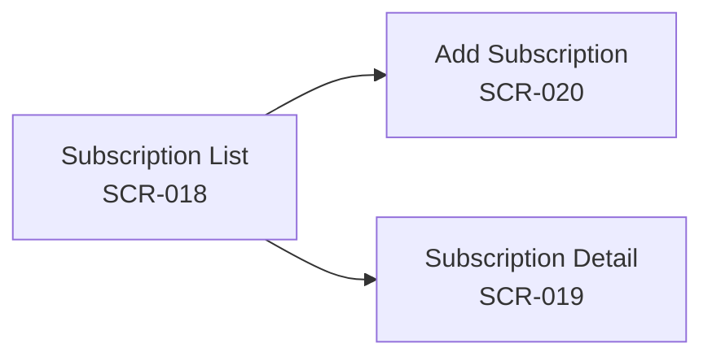
**Diagram Status:** Confirmed

### 3.6.6 Database Tables Used
| Table / Entity | Usage | Access Type | Evidence |
| --- | --- | --- | --- |
| `subscriptions` | Master recurring subscription agreement | Read / Write | `models/Subscription.js` |
| `customers` | Customer entity reference | Read | `models/Customer.js` |
| `products` | Product entity reference | Read | `models/Product.js` |

### 3.6.7 APIs Used
| Method | Endpoint | Purpose | Authentication | Handler / Service |
| --- | --- | --- | --- | --- |
| `POST` | `/api/vendor/subscriptions` | Create recurring subscription | Protected (`isVendorOwner`) | `subscription.controller.js:createSubscription` |
| `GET` | `/api/vendor/subscriptions` | List subscriptions (filter by customer/status) | Protected (`isVendorOwner`) | `subscription.controller.js:getSubscriptions` |
| `GET` | `/api/vendor/subscriptions/:id` | Get subscription detail | Protected (`isVendorOwner`) | `subscription.controller.js:getSubscriptionById` |
| `PATCH` | `/api/vendor/subscriptions/:id` | Update subscription rules/status | Protected (`isVendorOwner`) | `subscription.controller.js:updateSubscription` |
| `DELETE` | `/api/vendor/subscriptions/:id` | Soft delete subscription | Protected (`isVendorOwner`) | `subscription.controller.js:deleteSubscription` |

### 3.6.8 Validation Rules
#### Frontend Validation
* Customer and Product selections are required.
* Base quantity must be an integer >= 1.
* Recurrence pattern must be one of `daily`, `alternate_days`, `weekly`, `monthly`.

#### Backend Validation
* Joi schema validates recurrence pattern enum values.
* Controller validates that BOTH `customerId` and `productId` belong to the authenticated vendor's `serviceLineId`.

### 3.6.9 Business Rules
| Rule ID | Business Rule | Trigger / Condition | Outcome |
| --- | --- | --- | --- |
| **BR-MOD06-01** | Dual Service Line Ownership Guard | Creating subscription | Verifies Customer and Product both belong to owner's service line; rejects cross-vendor pairings. |
| **BR-MOD06-02** | Master Rule Isolation | Updating subscription | Subscription edits modify master rule going forward; does not alter historical generated delivery rows. |

### 3.6.10 Reports Generated
`No module-specific report generation was identified.`

### 3.6.11 Notifications
`No module-specific notification workflow identified.`

### 3.6.12 Dependencies
* **Internal:** MOD-03 Customers, MOD-04 Products, AWS S3 Service

### 3.6.13 Error Handling
* Returns `400 Bad Request` if Customer or Product ID does not belong to vendor.

### 3.6.14 Recommended Screenshots
| Screenshot ID | Screen | Purpose | Suggested Caption | Orientation | Priority |
| --- | --- | --- | --- | --- | --- |
| **SS-MOD06-01** | Subscription List | Overview list | Customer Subscription Directory Screen | Portrait | High |
| **SS-MOD06-02** | Add Subscription | Setup form | Create Recurring Subscription Screen | Portrait | High |

### 3.6.15 Module Notes / Confirmation Requirements
`None.`

---

## 3.7 MOD-07: Daily Deliveries Engine

### Module Metadata
* **Module ID:** MOD-07
* **Module Name:** Daily Deliveries Engine
* **Functional Area:** Field Task Execution & Fulfillment
* **Primary User Roles:** Vendor Owner, Staff
* **Module Status:** Confirmed

### 3.7.1 Purpose
The Daily Deliveries Engine is the core operational workhorse of the application. It executes recurrence algorithms to generate daily delivery tasks from long-term Subscriptions, freezes product unit prices at generation time, assigns drivers, tracks delivery completion status (delivered, skipped, pending), logs empty container collections, and records every status change in an immutable audit table (`DeliveryLog`).

### 3.7.2 Features
* Automated double-cron execution (8:00 PM evening and 2:00 AM morning triggers).
* Idempotent task generation (prevents duplicate tasks for the same subscription and date).
* Unit price freezing (`unit_price_charged`) at delivery generation time.
* Driver execution screen: Mark delivered/skipped, record full units delivered & empty cans collected.
* Audit logging of all status changes via `DeliveryLog`.
* Filter deliveries by date, route, and status.

### 3.7.3 User Roles
| User Role | Access / Responsibility | Permission Evidence |
| --- | --- | --- |
| **Vendor Owner** | Manual task generation, status override, view delivery history | `delivery.controller.js` |
| **Staff** | View daily route delivery list, mark tasks delivered/skipped, collect empty cans | Driver task execution views |

### 3.7.4 Main Screens
| Screen ID | Screen Name | Purpose | Route / Navigation | Source Evidence |
| --- | --- | --- | --- | --- |
| **SCR-021** | Daily Deliveries (Orders) Screen | Main driver/owner daily delivery execution sheet | `OrdersTab` | `Screens/Main/OrdersScreen.jsx` |
| **SCR-022** | Past Deliveries Screen | View historical completed delivery logs | `PastDeliveries` | `Screens/Main/PastDeliveriesScreen.jsx` |
| **SCR-023** | Unbilled Deliveries Screen | View delivered tasks pending invoice generation | `UnbilledDeliveries` | `Screens/Main/UnbilledDeliveriesScreen.jsx` |

### 3.7.5 Navigation Flow
Users open OrdersTab to view today's route deliveries. Tapping a delivery card opens status update controls to record full units delivered and empty cans collected.

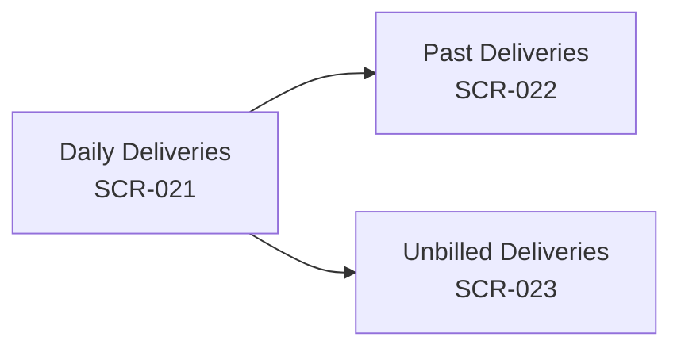
**Diagram Status:** Confirmed

### 3.7.6 Database Tables Used
| Table / Entity | Usage | Access Type | Evidence |
| --- | --- | --- | --- |
| `deliveries` | Daily delivery task record | Read / Write | `models/Delivery.js` |
| `delivery_logs` | Audit trail of status transitions | Write | `models/DeliveryLog.js` |
| `subscriptions` | Master recurring subscription source | Read | `models/Subscription.js` |
| `customers` | Customer entity reference | Read | `models/Customer.js` |

### 3.7.7 APIs Used
| Method | Endpoint | Purpose | Authentication | Handler / Service |
| --- | --- | --- | --- | --- |
| `POST` | `/api/vendor/deliveries/generate` | Trigger manual delivery generation | Protected (`isVendorOwner`) | `delivery.controller.js:generateDeliveriesForVendor` |
| `GET` | `/api/vendor/deliveries` | List daily deliveries (filter date/route/status) | Protected (Bearer JWT) | `delivery.controller.js:getDeliveries` |
| `PATCH` | `/api/vendor/deliveries/:id/status` | Update delivery status & write audit log | Protected (Bearer JWT) | `delivery.controller.js:updateDeliveryStatus` |

### 3.7.8 Validation Rules
#### Frontend Validation
* Full units delivered must be an integer >= 0.
* Empty units collected must be an integer >= 0.

#### Backend Validation
* Joi schema enforces status enum (`pending`, `delivered`, `skipped`).
* Controller verifies delivery belongs to customer within the vendor's service line.

### 3.7.9 Business Rules
| Rule ID | Business Rule | Trigger / Condition | Outcome |
| --- | --- | --- | --- |
| **BR-MOD07-01** | Price Freezing | Delivery task generation | Copies current `Product.price` into `Delivery.unit_price_charged` to guarantee historical billing accuracy. |
| **BR-MOD07-02** | Delivery Status Auditing | Status transition on delivery | Synchronously inserts row into `delivery_logs` capturing previous status, new status, role, and performer ID. |
| **BR-MOD07-03** | Task Idempotency | Generator execution | Checks `(subscriptionId + targetDate)` composite key; skips creation if delivery already exists. |

### 3.7.10 Reports Generated
`No module-specific report generation was identified.`

### 3.7.11 Notifications
`No module-specific notification workflow identified.`

### 3.7.12 Dependencies
* **Internal:** MOD-06 Subscriptions, MOD-03 Customers, MOD-05 Routes, `node-cron` Job

### 3.7.13 Error Handling
* Returns `404 Not Found` if delivery ID does not belong to vendor's customer.

### 3.7.14 Recommended Screenshots
| Screenshot ID | Screen | Purpose | Suggested Caption | Orientation | Priority |
| --- | --- | --- | --- | --- | --- |
| **SS-MOD07-01** | Daily Deliveries | Driver execution sheet | Today's Daily Delivery Task Sheet | Portrait | High |
| **SS-MOD07-02** | Unbilled Deliveries | Pending billing tasks | Unbilled Deliveries Overview Screen | Portrait | Medium |

### 3.7.15 Module Notes / Confirmation Requirements
`None.`

---

## 3.8 MOD-08: One-Time Orders

### Module Metadata
* **Module ID:** MOD-08
* **Module Name:** One-Time Orders
* **Functional Area:** Ad-hoc Sales & Order Processing
* **Primary User Roles:** Vendor Owner, Staff
* **Module Status:** Confirmed

### 3.8.1 Purpose
The One-Time Orders module handles non-subscription, ad-hoc sales requests (e.g., a customer requesting 5 extra water cans for an event). It supports multi-item order creation, staff driver assignment, order status updating, and automated conversion into fulfillment delivery tasks.

### 3.8.2 Features
* Ad-hoc order creation with multi-product line items.
* Automatic pricing calculation based on current product rates.
* One-click order fulfillment (`/fulfill` endpoint) converting order items into delivery tasks.
* Status tracking (`pending`, `fulfilled`, `cancelled`).

### 3.8.3 User Roles
| User Role | Access / Responsibility | Permission Evidence |
| --- | --- | --- |
| **Vendor Owner** | Create, view, fulfill, and cancel one-time orders | `isVendorOwner` guard on `one-time-order.routes.js` |
| **Staff** | View assigned one-time orders and fulfill deliveries | Staff order routes |

### 3.8.4 Main Screens
| Screen ID | Screen Name | Purpose | Route / Navigation | Source Evidence |
| --- | --- | --- | --- | --- |
| **SCR-024** | One-Time Order List Screen | View all ad-hoc customer orders | `OneTimeOrderList` | `Screens/Main/OneTimeOrderListScreen.jsx` |
| **SCR-025** | Add One-Time Order Screen | Form to add ad-hoc items and assign to customer | `AddOneTimeOrder` | `Screens/Main/AddOneTimeOrderScreen.jsx` |

### 3.8.5 Navigation Flow
From the One-Time Order List Screen, users tap Add Order to create ad-hoc items, or select an order to fulfill.

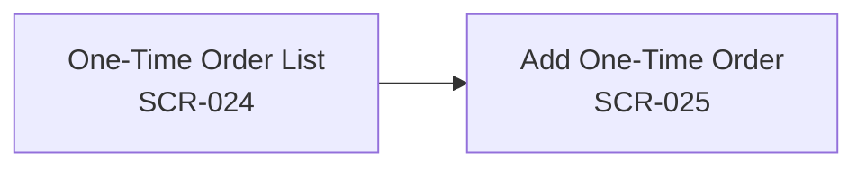
**Diagram Status:** Confirmed

### 3.8.6 Database Tables Used
| Table / Entity | Usage | Access Type | Evidence |
| --- | --- | --- | --- |
| `one_time_orders` | Master order record | Read / Write | `models/OneTimeOrder.js` |
| `one_time_order_items` | Individual line items for order | Read / Write | `models/OneTimeOrderItem.js` |
| `deliveries` | Fulfillment task generated | Write | `models/Delivery.js` |

### 3.8.7 APIs Used
| Method | Endpoint | Purpose | Authentication | Handler / Service |
| --- | --- | --- | --- | --- |
| `POST` | `/api/vendor/one-time-orders` | Create ad-hoc order | Protected (`isVendorOwner`) | `one-time-order.controller.js:createOrder` |
| `GET` | `/api/vendor/one-time-orders` | List orders | Protected (`isVendorOwner`) | `one-time-order.controller.js:getOrders` |
| `POST` | `/api/vendor/one-time-orders/:id/fulfill` | Convert order into delivery task | Protected (`isVendorOwner`) | `one-time-order.controller.js:fulfillOneTimeOrder` |
| `PATCH` | `/api/vendor/one-time-orders/:id/status` | Update order status | Protected (`isVendorOwner`) | `one-time-order.controller.js:updateOrderStatus` |

### 3.8.8 Validation Rules
#### Frontend Validation
* Customer selection is required.
* At least one product item with quantity >= 1 is required.

#### Backend Validation
* Joi schema validates `customerId`, array of `items` with positive quantities.
* Verifies customer belongs to vendor's service line.

### 3.8.9 Business Rules
| Rule ID | Business Rule | Trigger / Condition | Outcome |
| --- | --- | --- | --- |
| **BR-MOD08-01** | Order Fulfillment Task Creation | `/fulfill` endpoint called | Creates corresponding `Delivery` record linking `one_time_order_item_id` and setting status to delivered/fulfilled. |

### 3.8.10 Reports Generated
`No module-specific report generation was identified.`

### 3.8.11 Notifications
`No module-specific notification workflow identified.`

### 3.8.12 Dependencies
* **Internal:** MOD-03 Customers, MOD-04 Products, MOD-07 Deliveries

### 3.8.13 Error Handling
* Returns `400 Bad Request` if order items array is empty.

### 3.8.14 Recommended Screenshots
| Screenshot ID | Screen | Purpose | Suggested Caption | Orientation | Priority |
| --- | --- | --- | --- | --- | --- |
| **SS-MOD08-01** | One-Time Order List | Order list view | Ad-Hoc One-Time Orders Screen | Portrait | High |
| **SS-MOD08-02** | Add One-Time Order | Order form | Create Ad-Hoc Sales Order Screen | Portrait | Medium |

### 3.8.15 Module Notes / Confirmation Requirements
`None.`

---

## 3.9 MOD-09: Invoicing & Billing

### Module Metadata
* **Module ID:** MOD-09
* **Module Name:** Invoicing & Billing
* **Functional Area:** Financial Billing & PDF Generation
* **Primary User Roles:** Vendor Owner
* **Module Status:** Confirmed

### 3.9.1 Purpose
The Invoicing & Billing module automates billing workflows for completed deliveries. It generates pre-billing summary calculations, compiles unbilled delivery tasks into itemized customer invoices, posts debit transactions to customer account ledgers, and produces downloadable/printable PDF invoices via Handlebars HTML templates and mobile print bridges.

### 3.9.2 Features
* Pre-summary calculation (`/pre-summary`) showing uninvoiced delivery amounts grouped by customer.
* Batch invoice generation for selected customers over date ranges.
* Automated posting of debit entries to `CustomerAccountLedger`.
* Invoice detail view with itemized delivery line items.
* PDF document generation and printing (`react-native-html-to-pdf`, `react-native-print`).

### 3.9.3 User Roles
| User Role | Access / Responsibility | Permission Evidence |
| --- | --- | --- |
| **Vendor Owner** | Generate invoices, view pre-summaries, download PDF invoices | `isVendorOwner` guard on `/api/vendor/invoices` |

### 3.9.4 Main Screens
| Screen ID | Screen Name | Purpose | Route / Navigation | Source Evidence |
| --- | --- | --- | --- | --- |
| **SCR-026** | Invoice List Screen | Directory of all generated invoices | `InvoiceList` | `Screens/Main/InvoiceListScreen.jsx` |
| **SCR-027** | Invoice Detail Screen | View itemized invoice lines & trigger PDF print | `InvoiceDetail` | `Screens/Main/InvoiceDetailScreen.jsx` |
| **SCR-028** | Generate Invoice Screen | Pre-billing summary & batch invoice generation | `GenerateInvoice` | `Screens/Main/GenerateInvoiceScreen.jsx` |

### 3.9.5 Navigation Flow
From the Invoice List Screen, owners tap Generate Invoice to view unbilled summaries and trigger batch invoice generation, or select an existing invoice to view line items and print PDFs.

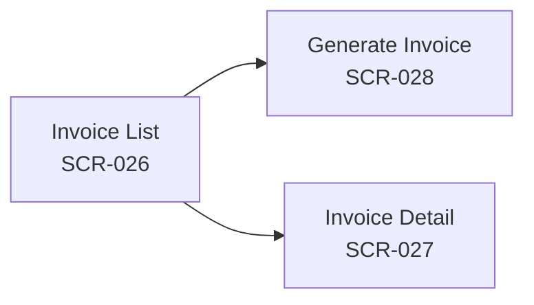
**Diagram Status:** Confirmed

### 3.9.6 Database Tables Used
| Table / Entity | Usage | Access Type | Evidence |
| --- | --- | --- | --- |
| `invoices` | Master invoice record | Read / Write | `models/Invoice.js` |
| `invoice_line_items` | Individual line items on invoice | Read / Write | `models/InvoiceLineItem.js` |
| `deliveries` | Delivery tasks linked to invoice | Read / Write | `models/Delivery.js` |
| `customer_account_ledgers` | Posts debit entry for total invoice amount | Write | `models/CustomerAccountLedger.js` |

### 3.9.7 APIs Used
| Method | Endpoint | Purpose | Authentication | Handler / Service |
| --- | --- | --- | --- | --- |
| `GET` | `/api/vendor/invoices/pre-summary` | Fetch uninvoiced delivery summary | Protected (`isVendorOwner`) | `invoice.controller.js:getUninvoicedSummary` |
| `POST` | `/api/vendor/invoices/generate` | Batch generate invoices | Protected (`isVendorOwner`) | `invoice.controller.js:generateInvoices` |
| `GET` | `/api/vendor/invoices` | List invoices | Protected (`isVendorOwner`) | `invoice.controller.js:getInvoices` |
| `GET` | `/api/vendor/invoices/:id` | Get single invoice detail | Protected (`isVendorOwner`) | `invoice.controller.js:getInvoiceById` |
| `GET` | `/api/vendor/invoices/:id/download` | Download invoice PDF payload | Protected (`isVendorOwner`) | `invoice.controller.js:downloadInvoice` |

### 3.9.8 Validation Rules
#### Frontend Validation
* Customer selection and valid date ranges required for batch invoice generation.

#### Backend Validation
* Controller validates `customerIds` array and date range formats.
* Ensures deliveries are status `'delivered'` and not previously linked to an `invoice_id`.

### 3.9.9 Business Rules
| Rule ID | Business Rule | Trigger / Condition | Outcome |
| --- | --- | --- | --- |
| **BR-MOD09-01** | Transactional Invoice Posting | Batch invoice generation | Creates Invoice, creates line items, links `deliveries.invoice_id`, and posts Debit to `CustomerAccountLedger` in a single SQL transaction. |
| **BR-MOD09-02** | Double Billing Prevention | Invoice generation | Queries deliveries where `invoice_id IS NULL`; prevents re-invoicing already billed deliveries. |

### 3.9.10 Reports Generated
| Report / Output | Purpose | Format | Trigger / Access Point |
| --- | --- | --- | --- |
| **Customer Invoice PDF** | Formal billing statement | PDF Document | Download / Print button on `SCR-027` |

### 3.9.11 Notifications
`No module-specific notification workflow identified.`

### 3.9.12 Dependencies
* **Internal:** MOD-07 Deliveries, MOD-03 Customers, Handlebars Templates (`src/tamplates/`)
* **External:** `react-native-html-to-pdf`, `react-native-print`

### 3.9.13 Error Handling
* Returns `400 Bad Request` if no uninvoiced deliveries exist in selected date range.

### 3.9.14 Recommended Screenshots
| Screenshot ID | Screen | Purpose | Suggested Caption | Orientation | Priority |
| --- | --- | --- | --- | --- | --- |
| **SS-MOD09-01** | Invoice List | Directory view | Generated Invoices Directory Screen | Portrait | High |
| **SS-MOD09-02** | Generate Invoice | Pre-summary UI | Pre-Billing Summary & Batch Generation Screen | Portrait | High |
| **SS-MOD09-03** | Invoice Detail | Billing breakdown | Invoice Detail & Line Items Screen | Portrait | Medium |

### 3.9.15 Module Notes / Confirmation Requirements
`None.`

---

## 3.10 MOD-10: Financial Ledgers & Deposit Management

### Module Metadata
* **Module ID:** MOD-10
* **Module Name:** Financial Ledgers & Deposit Management
* **Functional Area:** Customer Accounting & Deposit Management
* **Primary User Roles:** Vendor Owner
* **Module Status:** Confirmed

### 3.10.1 Purpose
The Financial Ledgers & Deposit Management module manages customer accounts, payment collections, multi-invoice payment allocations, running balances, and returnable container deposit accounts. It enables recording cash/online payments, allocating credits against outstanding invoices, collecting bottle deposits, settling deposits against unpaid bills, and issuing deposit refunds.

### 3.10.2 Features
* Record customer payment credits (cash, UPI, bank transfer, check).
* Multi-invoice payment allocation engine (allocates payments to oldest unpaid invoices in `PaymentAllocation`).
* Account statement ledger view (`getAccountStatement`) showing running balances.
* Collect returnable bottle deposits (`/deposits/collect`).
* Settle customer deposits against unpaid invoice bills (`/deposits/settle-to-bill`).
* Issue deposit refunds (`/deposits/refund`).

### 3.10.3 User Roles
| User Role | Access / Responsibility | Permission Evidence |
| --- | --- | --- |
| **Vendor Owner** | Full accounting access: record payments, allocate funds, collect/settle/refund deposits | `isVendorOwner` guard on ledger & deposit routes |

### 3.10.4 Main Screens
| Screen ID | Screen Name | Purpose | Route / Navigation | Source Evidence |
| --- | --- | --- | --- | --- |
| **SCR-029** | Payments & Ledgers Screen | Record payments, view account statements & deposits | `PaymentsTab` | `Screens/Main/PaymentsScreen.jsx` |

### 3.10.5 Navigation Flow
The Payments Screen provides tabbed interactions to record payments, inspect ledger statements, and manage bottle deposits.

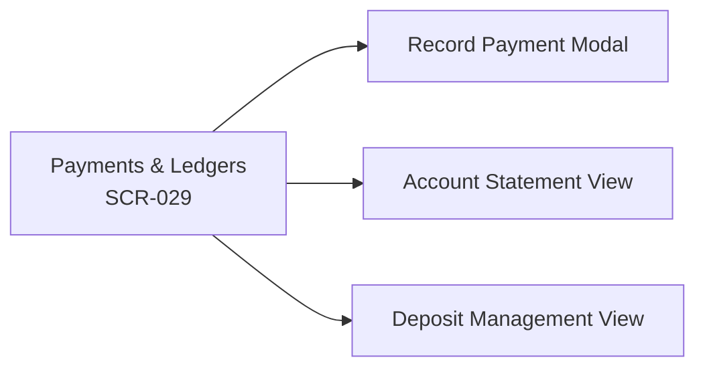
**Diagram Status:** Confirmed

### 3.10.6 Database Tables Used
| Table / Entity | Usage | Access Type | Evidence |
| --- | --- | --- | --- |
| `customer_account_ledgers` | Master account ledger entries (Debit/Credit) | Read / Write | `models/CustomerAccountLedger.js` |
| `customer_deposit_ledgers` | Deposit ledger entries (Collection/Settlement/Refund) | Read / Write | `models/CustomerDepositLedger.js` |
| `payment_allocations` | Link payment ledger entries to specific invoices | Write | `models/PaymentAllocation.js` |
| `customers` | Update `current_balance` running tally | Read / Write | `models/Customer.js` |

### 3.10.7 APIs Used
| Method | Endpoint | Purpose | Authentication | Handler / Service |
| --- | --- | --- | --- | --- |
| `POST` | `/api/vendor/ledgers/payment` | Record payment credit & allocate | Protected (`isVendorOwner`) | `ledger.controller.js:recordPayment` |
| `GET` | `/api/vendor/ledgers/account/:customerId` | Get customer account statement | Protected (`isVendorOwner`) | `ledger.controller.js:getAccountStatement` |
| `POST` | `/api/vendor/deposits/collect` | Collect bottle deposit | Protected (`isVendorOwner`) | `deposit.controller.js:collectDeposit` |
| `POST` | `/api/vendor/deposits/settle-to-bill` | Settle deposit against invoice | Protected (`isVendorOwner`) | `deposit.controller.js:settleDepositToBill` |
| `POST` | `/api/vendor/deposits/refund` | Refund bottle deposit to customer | Protected (`isVendorOwner`) | `deposit.controller.js:refundDeposit` |
| `GET` | `/api/vendor/deposits/:customerId` | Get customer deposit ledger | Protected (`isVendorOwner`) | `deposit.controller.js:getDepositLedger` |

### 3.10.8 Validation Rules
#### Frontend Validation
* Payment `amount` must be a positive decimal.
* Payment mode selection is required (cash, upi, bank_transfer, cheque).

#### Backend Validation
* Joi schema validates positive numeric `amount` and enum values for payment mode.
* Controller validates customer belongs to owner's service line.

### 3.10.9 Business Rules
| Rule ID | Business Rule | Trigger / Condition | Outcome |
| --- | --- | --- | --- |
| **BR-MOD10-01** | FIFO Payment Allocation | Payment recorded | Automatically allocates credit to oldest unpaid customer invoices, creating `PaymentAllocation` records until payment is fully exhausted. |
| **BR-MOD10-02** | Running Balance Tally | Debit/Credit posted | Updates `Customer.current_balance` atomically (Positive = customer owes money; Negative = credit). |

### 3.10.10 Reports Generated
| Report / Output | Purpose | Format | Trigger / Access Point |
| --- | --- | --- | --- |
| **Account Ledger Statement** | Customer financial statement | On-Screen / Print | `SCR-029` Account Statement View |

### 3.10.11 Notifications
`No module-specific notification workflow identified.`

### 3.10.12 Dependencies
* **Internal:** MOD-03 Customers, MOD-09 Invoicing

### 3.10.13 Error Handling
* Returns `400 Bad Request` on insufficient deposit balance during refund or settlement operations.

### 3.10.14 Recommended Screenshots
| Screenshot ID | Screen | Purpose | Suggested Caption | Orientation | Priority |
| --- | --- | --- | --- | --- | --- |
| **SS-MOD10-01** | Payments & Ledgers | Payment UI | Customer Payments & Ledger Screen | Portrait | High |
| **SS-MOD10-02** | Deposit Management | Deposit UI | Container Deposit Ledger Screen | Portrait | Medium |

### 3.10.15 Module Notes / Confirmation Requirements
`None.`

---

## 3.11 MOD-11: Staff Management

### Module Metadata
* **Module ID:** MOD-11
* **Module Name:** Staff Management
* **Functional Area:** Human Resources & Access Control
* **Primary User Roles:** Vendor Owner
* **Module Status:** Confirmed

### 3.11.1 Purpose
Staff Management allows Vendor Owners to provision and manage employee accounts (such as delivery drivers). Owners create staff records with unique phone numbers, activate/deactivate accounts to control app login permissions, update staff contact details, and soft delete offboarded employees while preserving their historical delivery execution logs.

### 3.11.2 Features
* Provision staff driver accounts (`role: 'staff'`).
* Phone uniqueness enforcement across the platform.
* Active/Inactive status toggle (inactive staff are blocked from OTP login).
* Soft deletion protecting historical `DeliveryLog` and `StaffRoute` records.

### 3.11.3 User Roles
| User Role | Access / Responsibility | Permission Evidence |
| --- | --- | --- |
| **Vendor Owner** | Add, edit, activate, deactivate, and soft delete staff | `isVendorOwner` guard on `/api/vendor/staff` |

### 3.11.4 Main Screens
| Screen ID | Screen Name | Purpose | Route / Navigation | Source Evidence |
| --- | --- | --- | --- | --- |
| **SCR-030** | Staff Management Screen | List all provisioned staff members | `StaffManagement` | `Screens/Main/StaffManagementScreen.jsx` |
| **SCR-031** | Add / Edit Staff Screen | Form to add or update staff credentials | `AddStaff` | `Screens/Main/AddStaffScreen.jsx` |

### 3.11.5 Navigation Flow
From Staff Management, owners tap Add Staff to provision a new driver or select an existing staff member to modify details or toggle active status.

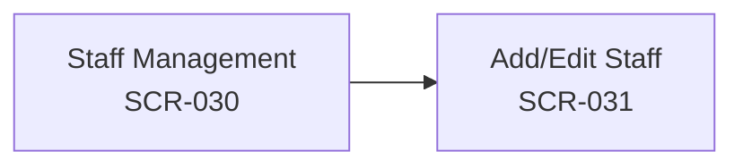
**Diagram Status:** Confirmed

### 3.11.6 Database Tables Used
| Table / Entity | Usage | Access Type | Evidence |
| --- | --- | --- | --- |
| `users` | User accounts filtered by `role: 'staff'` | Read / Write | `models/User.js` |
| `vendor_accounts` | Scope staff to vendor account | Read | `models/VendorAccount.js` |

### 3.11.7 APIs Used
| Method | Endpoint | Purpose | Authentication | Handler / Service |
| --- | --- | --- | --- | --- |
| `POST` | `/api/vendor/staff` | Add new staff member | Protected (`isVendorOwner`) | `staff.controller.js:addStaff` |
| `GET` | `/api/vendor/staff` | List all staff for vendor | Protected (`isVendorOwner`) | `staff.controller.js:getStaff` |
| `GET` | `/api/vendor/staff/:id` | Get single staff detail | Protected (`isVendorOwner`) | `staff.controller.js:getStaffById` |
| `PATCH` | `/api/vendor/staff/:id` | Update staff details / toggle status | Protected (`isVendorOwner`) | `staff.controller.js:updateStaff` |
| `DELETE` | `/api/vendor/staff/:id` | Soft delete staff member | Protected (`isVendorOwner`) | `staff.controller.js:deleteStaff` |

### 3.11.8 Validation Rules
#### Frontend Validation
* Staff `name` and valid phone number are required.

#### Backend Validation
* Joi schema validates phone format and name string.
* System-wide check ensures phone number does not already exist in `users` table.

### 3.11.9 Business Rules
| Rule ID | Business Rule | Trigger / Condition | Outcome |
| --- | --- | --- | --- |
| **BR-MOD11-01** | Staff Account Scoping | Creating staff account | Automatically sets `role: 'staff'` and binds `vendorAccountId` from owner's JWT. |
| **BR-MOD11-02** | Inactive Login Block | Staff attempts OTP login | `requestOtp` rejects logins if `user.status !== 'active'`. |

### 3.11.10 Reports Generated
`No module-specific report generation was identified.`

### 3.11.11 Notifications
`No module-specific notification workflow identified.`

### 3.11.12 Dependencies
* **Internal:** MOD-01 Authentication, MOD-05 Route Logistics

### 3.11.13 Error Handling
* Returns `400 Bad Request` if phone number is already registered in the platform.

### 3.11.14 Recommended Screenshots
| Screenshot ID | Screen | Purpose | Suggested Caption | Orientation | Priority |
| --- | --- | --- | --- | --- | --- |
| **SS-MOD11-01** | Staff Management | Directory view | Staff Driver Management Screen | Portrait | High |
| **SS-MOD11-02** | Add Staff | Provision form | Add New Staff Member Screen | Portrait | Medium |

### 3.11.15 Module Notes / Confirmation Requirements
`None.`

---

## 3.12 MOD-12: System Settings & Profile

### Module Metadata
* **Module ID:** MOD-12
* **Module Name:** System Settings & Profile
* **Functional Area:** App Configuration & Vendor Profile
* **Primary User Roles:** Vendor Owner
* **Module Status:** Confirmed

### 3.12.1 Purpose
The System Settings & Profile module allows Vendor Owners to view and update business profile details, business name, owner contact information, language preferences (English / Hindi via `i18next`), and sign out of the mobile client application.

### 3.12.2 Features
* View and update vendor business profile and contact details.
* Internationalization language switcher (English / Hindi).
* App version and environment display.
* Secure logout clearing JWT tokens from local `AsyncStorage`.

### 3.12.3 User Roles
| User Role | Access / Responsibility | Permission Evidence |
| --- | --- | --- |
| **Vendor Owner** | View and update profile settings, toggle app language, logout | `isVendorOwner` guard on vendor routes |

### 3.12.4 Main Screens
| Screen ID | Screen Name | Purpose | Route / Navigation | Source Evidence |
| --- | --- | --- | --- | --- |
| **SCR-032** | User Profile Screen | View owner and business profile details | `Profile` | `Screens/Main/ProfileScreen.jsx` |
| **SCR-033** | System Settings Screen | Configure app settings, language, & logout | `Settings` | `Screens/Main/SettingsScreen.jsx` |

### 3.12.5 Navigation Flow
Users access Profile and Settings screens from the main drawer or header icons.

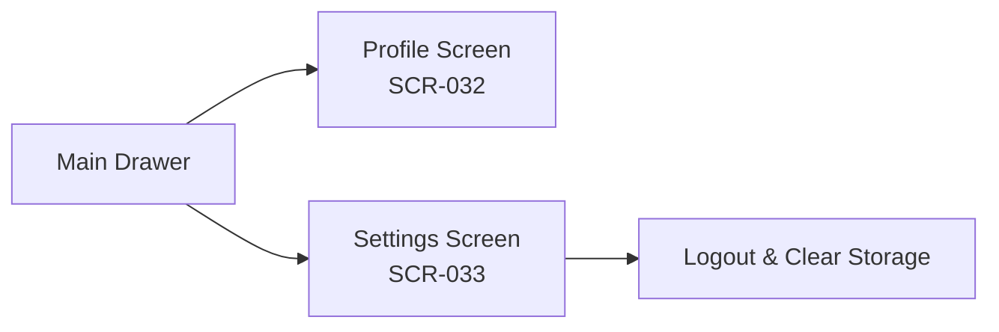
**Diagram Status:** Confirmed

### 3.12.6 Database Tables Used
| Table / Entity | Usage | Access Type | Evidence |
| --- | --- | --- | --- |
| `vendor_accounts` | Vendor profile details | Read / Write | `models/VendorAccount.js` |
| `users` | Owner contact details | Read / Write | `models/User.js` |

### 3.12.7 APIs Used
| Method | Endpoint | Purpose | Authentication | Handler / Service |
| --- | --- | --- | --- | --- |
| `GET` | `/api/vendor/profile` | Fetch vendor profile | Protected (`isVendorOwner`) | `vendor.controller.js:getVendorProfile` |
| `PATCH` | `/api/vendor/profile` | Update vendor profile details | Protected (`isVendorOwner`) | `vendor.controller.js:updateVendorProfile` |

### 3.12.8 Validation Rules
#### Frontend Validation
* Business name and owner name non-empty string validation.

#### Backend Validation
* Joi schema validates optional update fields.

### 3.12.9 Business Rules
| Rule ID | Business Rule | Trigger / Condition | Outcome |
| --- | --- | --- | --- |
| **BR-MOD12-01** | Session Invalidation | Logout button tapped | Clears JWT token from `AsyncStorage` and resets AuthContext state. |

### 3.12.10 Reports Generated
`No module-specific report generation was identified.`

### 3.12.11 Notifications
`No module-specific notification workflow identified.`

### 3.12.12 Dependencies
* **Internal:** MOD-01 Authentication, `i18next` framework

### 3.12.13 Error Handling
* Toast alerts on profile update failure.

### 3.12.14 Recommended Screenshots
| Screenshot ID | Screen | Purpose | Suggested Caption | Orientation | Priority |
| --- | --- | --- | --- | --- | --- |
| **SS-MOD12-01** | User Profile | Profile view | Vendor Account Profile Screen | Portrait | Medium |
| **SS-MOD12-02** | System Settings | Settings view | System Settings & Language Screen | Portrait | Medium |

### 3.12.15 Module Notes / Confirmation Requirements
`None.`

---

# Cross-Module Dependency Matrix

| Module | Depends On | Dependency Type | Reason |
| --- | --- | --- | --- |
| **MOD-01 Auth** | None | Primary | Foundation for all identity and JWT issuance. |
| **MOD-02 Dashboard** | MOD-01, MOD-03, MOD-04, MOD-05, MOD-07 | Functional | Fetches aggregate metrics across customers, products, routes, and deliveries. |
| **MOD-03 Customers** | MOD-01, MOD-05 | Data & Functional | Customers depend on Auth and belong to delivery routes (MOD-05). |
| **MOD-04 Products** | MOD-01, AWS S3 | Data & Infrastructure | Products depend on Auth and store images on AWS S3. |
| **MOD-05 Routes** | MOD-01, MOD-11 | Data & Functional | Routes depend on Auth and assign staff drivers (MOD-11). |
| **MOD-06 Subscriptions** | MOD-03, MOD-04 | Data | Subscriptions pair a Customer (MOD-03) with a Product (MOD-04). |
| **MOD-07 Deliveries** | MOD-06, MOD-03, MOD-05, MOD-11 | Process & Data | Deliveries are generated from Subscriptions for Customers along Routes with Staff. |
| **MOD-08 One-Time Orders** | MOD-03, MOD-04, MOD-07 | Process & Data | Ad-hoc orders select Customers and Products, creating Delivery fulfillment tasks. |
| **MOD-09 Invoicing** | MOD-07, MOD-03 | Financial Process | Invoices compile unbilled Deliveries (MOD-07) and post debits to Customer ledgers. |
| **MOD-10 Ledgers** | MOD-09, MOD-03 | Accounting Process | Payments allocate against Invoices (MOD-09); deposits manage bottle balances. |
| **MOD-11 Staff** | MOD-01 | Data & Identity | Staff users share the `users` table and authenticate via MOD-01. |
| **MOD-12 Settings** | MOD-01 | Configuration | Profile updates and session management depend on Auth. |

---

# Role-to-Module Matrix

| Role | Module | View | Create | Edit | Delete | Approve / Special Action |
| --- | --- | --- | --- | --- | --- | --- |
| **Vendor Owner** | MOD-01 Auth | Yes | Yes | Yes | No | Complete Registration |
| **Vendor Owner** | MOD-02 Dashboard | Yes | No | No | No | View Analytics |
| **Vendor Owner** | MOD-03 Customers | Yes | Yes | Yes | Yes | Sequence Stop Orders |
| **Vendor Owner** | MOD-04 Products | Yes | Yes | Yes | Yes | Manage Deposit Rates |
| **Vendor Owner** | MOD-05 Routes | Yes | Yes | Yes | Yes | Assign Drivers to Routes |
| **Vendor Owner** | MOD-06 Subscriptions | Yes | Yes | Yes | Yes | Pause / Activate Rules |
| **Vendor Owner** | MOD-07 Deliveries | Yes | Yes | Yes | No | Manual Task Generation |
| **Vendor Owner** | MOD-08 One-Time Orders | Yes | Yes | Yes | Yes | Fulfill Ad-hoc Orders |
| **Vendor Owner** | MOD-09 Invoicing | Yes | Yes | No | No | Batch Generate & Download PDF |
| **Vendor Owner** | MOD-10 Ledgers | Yes | Yes | Yes | No | Settle Deposits / Refund |
| **Vendor Owner** | MOD-11 Staff | Yes | Yes | Yes | Yes | Activate / Deactivate Staff |
| **Vendor Owner** | MOD-12 Settings | Yes | No | Yes | No | Language Toggle & Logout |
| **Staff Driver** | MOD-01 Auth | Yes | No | No | No | Login via OTP |
| **Staff Driver** | MOD-03 Customers | Yes | No | No | No | Read Address & Phone |
| **Staff Driver** | MOD-07 Deliveries | Yes | No | Yes | No | Mark Delivered & Collect Cans |
| **Staff Driver** | MOD-08 One-Time Orders | Yes | Yes | Yes | No | Fulfill Assigned Orders |
| **Customer** | MOD-01 Auth | Yes | No | No | No | Login via OTP |

---

# Module-to-Database Matrix

| Module | Primary Tables | Supporting Tables |
| --- | --- | --- |
| **MOD-01 Auth** | `users`, `otp_logs`, `vendor_accounts` | `vendor_service_lines`, `business_categories` |
| **MOD-02 Dashboard** | `vendor_accounts` | `customers`, `products`, `routes`, `deliveries` |
| **MOD-03 Customers** | `customers` | `routes`, `vendor_service_lines` |
| **MOD-04 Products** | `products` | `vendor_service_lines` |
| **MOD-05 Routes** | `routes`, `staff_routes` | `customers`, `users` |
| **MOD-06 Subscriptions** | `subscriptions` | `customers`, `products`, `subscription_overrides`, `subscription_pauses` |
| **MOD-07 Deliveries** | `deliveries`, `delivery_logs` | `subscriptions`, `customers`, `routes`, `users` |
| **MOD-08 One-Time Orders** | `one_time_orders`, `one_time_order_items` | `customers`, `products`, `deliveries` |
| **MOD-09 Invoicing** | `invoices`, `invoice_line_items` | `deliveries`, `customers`, `customer_account_ledgers` |
| **MOD-10 Ledgers** | `customer_account_ledgers`, `customer_deposit_ledgers` | `payment_allocations`, `customers`, `invoices` |
| **MOD-11 Staff** | `users` | `vendor_accounts`, `staff_routes` |
| **MOD-12 Settings** | `vendor_accounts`, `users` | `vendor_service_lines` |

---

# Module-to-API Matrix

| Module | API Group / Main Endpoints |
| --- | --- |
| **MOD-01 Auth** | `/api/public/categories`, `/api/auth/request-otp`, `/api/auth/verify-otp`, `/api/auth/complete-registration` |
| **MOD-02 Dashboard** | `/api/vendor/dashboard`, `/api/vendor/profile` |
| **MOD-03 Customers** | `/api/vendor/customers` (GET, POST, PATCH, DELETE) |
| **MOD-04 Products** | `/api/vendor/products` (GET, POST, PATCH, DELETE) |
| **MOD-05 Routes** | `/api/vendor/routes` (GET, POST, PATCH, DELETE, `/assign-staff`) |
| **MOD-06 Subscriptions** | `/api/vendor/subscriptions` (GET, POST, PATCH, DELETE) |
| **MOD-07 Deliveries** | `/api/vendor/deliveries` (GET, `/generate`, `/:id/status`) |
| **MOD-08 One-Time Orders** | `/api/vendor/one-time-orders` (GET, POST, `/:id/fulfill`, `/:id/status`) |
| **MOD-09 Invoicing** | `/api/vendor/invoices` (GET, `/pre-summary`, `/generate`, `/:id/download`) |
| **MOD-10 Ledgers** | `/api/vendor/ledgers/payment`, `/api/vendor/deposits` (`/collect`, `/settle-to-bill`, `/refund`) |
| **MOD-11 Staff** | `/api/vendor/staff` (GET, POST, PATCH, DELETE) |
| **MOD-12 Settings** | `/api/vendor/profile` (GET, PATCH) |

---

# Module Screenshot Index

| Screenshot ID | Module | Screen | Priority | Recommended Orientation |
| --- | --- | --- | --- | --- |
| **SS-MOD01-01** | MOD-01 Auth | Login Screen (`SCR-001`) | High | Portrait |
| **SS-MOD01-02** | MOD-01 Auth | OTP Verification Screen (`SCR-002`) | High | Portrait |
| **SS-MOD01-03** | MOD-01 Auth | Complete Registration Screen (`SCR-004`) | High | Portrait |
| **SS-MOD02-01** | MOD-02 Dashboard | Home Dashboard Screen (`SCR-005`) | High | Portrait |
| **SS-MOD03-01** | MOD-03 Customers | Customer List Screen (`SCR-006`) | High | Portrait |
| **SS-MOD03-02** | MOD-03 Customers | Add Customer Screen (`SCR-008`) | High | Portrait |
| **SS-MOD03-03** | MOD-03 Customers | Customer Detail Screen (`SCR-007`) | Medium | Portrait |
| **SS-MOD04-01** | MOD-04 Products | Product Catalog Screen (`SCR-011`) | High | Portrait |
| **SS-MOD04-02** | MOD-04 Products | Add Product Screen (`SCR-013`) | High | Portrait |
| **SS-MOD05-01** | MOD-05 Routes | Route List Screen (`SCR-014`) | High | Portrait |
| **SS-MOD05-02** | MOD-05 Routes | Route Builder Screen (`SCR-017`) | High | Portrait |
| **SS-MOD06-01** | MOD-06 Subscriptions | Subscription List Screen (`SCR-018`) | High | Portrait |
| **SS-MOD06-02** | MOD-06 Subscriptions | Add Subscription Screen (`SCR-020`) | High | Portrait |
| **SS-MOD07-01** | MOD-07 Deliveries | Daily Deliveries (Orders) Screen (`SCR-021`) | High | Portrait |
| **SS-MOD07-02** | MOD-07 Deliveries | Unbilled Deliveries Screen (`SCR-023`) | Medium | Portrait |
| **SS-MOD08-01** | MOD-08 One-Time Orders | One-Time Order List Screen (`SCR-024`) | High | Portrait |
| **SS-MOD08-02** | MOD-08 One-Time Orders | Add One-Time Order Screen (`SCR-025`) | Medium | Portrait |
| **SS-MOD09-01** | MOD-09 Invoicing | Invoice List Screen (`SCR-026`) | High | Portrait |
| **SS-MOD09-02** | MOD-09 Invoicing | Generate Invoice Screen (`SCR-028`) | High | Portrait |
| **SS-MOD09-03** | MOD-09 Invoicing | Invoice Detail Screen (`SCR-027`) | Medium | Portrait |
| **SS-MOD10-01** | MOD-10 Ledgers | Payments & Ledgers Screen (`SCR-029`) | High | Portrait |
| **SS-MOD10-02** | MOD-10 Ledgers | Deposit Ledger View (`SCR-029`) | Medium | Portrait |
| **SS-MOD11-01** | MOD-11 Staff | Staff Management Screen (`SCR-030`) | High | Portrait |
| **SS-MOD11-02** | MOD-11 Staff | Add Staff Screen (`SCR-031`) | Medium | Portrait |
| **SS-MOD12-01** | MOD-12 Settings | User Profile Screen (`SCR-032`) | Medium | Portrait |
| **SS-MOD12-02** | MOD-12 Settings | System Settings Screen (`SCR-033`) | Medium | Portrait |

---

# Module Evidence Matrix

| Module | Frontend Evidence | Backend Evidence | Database Evidence | Other Evidence |
| --- | --- | --- | --- | --- |
| **MOD-01 Auth** | `Screens/Auth/` | `controllers/auth.controller.js` | `models/OtpLog.js`, `models/User.js` | `memoryBank/auth.md` |
| **MOD-02 Dashboard** | `Screens/Main/HomeScreen.jsx` | `controllers/vendor.controller.js` | `models/VendorAccount.js` | API responses |
| **MOD-03 Customers** | `Screens/Main/Customer*.jsx` | `controllers/customer.controller.js` | `models/Customer.js` | `memoryBank/customer.md` |
| **MOD-04 Products** | `Screens/Main/Product*.jsx` | `controllers/product.controller.js` | `models/Product.js` | `memoryBank/product.md`, `services/s3.service.js` |
| **MOD-05 Routes** | `Screens/Main/Route*.jsx` | `controllers/route.controller.js` | `models/Route.js`, `StaffRoute.js` | `memoryBank/route.md` |
| **MOD-06 Subscriptions** | `Screens/Main/Subscription*.jsx` | `controllers/subscription.controller.js` | `models/Subscription.js` | `memoryBank/subscription.md` |
| **MOD-07 Deliveries** | `Screens/Main/OrdersScreen.jsx` | `services/delivery-generator.service.js` | `models/Delivery.js`, `DeliveryLog.js` | `memoryBank/delivery.md`, `jobs/delivery.cron.js` |
| **MOD-08 One-Time Orders** | `Screens/Main/OneTimeOrder*.jsx` | `controllers/one-time-order.controller.js` | `models/OneTimeOrder.js`, `OneTimeOrderItem.js` | `memoryBank/one-time-order.md` |
| **MOD-09 Invoicing** | `Screens/Main/Invoice*.jsx` | `controllers/invoice.controller.js` | `models/Invoice.js`, `InvoiceLineItem.js` | Handlebars templates |
| **MOD-10 Ledgers** | `Screens/Main/PaymentsScreen.jsx` | `controllers/ledger.controller.js`, `deposit.controller.js` | `models/CustomerAccountLedger.js`, `CustomerDepositLedger.js` | `models/PaymentAllocation.js` |
| **MOD-11 Staff** | `Screens/Main/Staff*.jsx` | `controllers/staff.controller.js` | `models/User.js` (role: staff) | `memoryBank/staff.md` |
| **MOD-12 Settings** | `Screens/Main/SettingsScreen.jsx` | `controllers/vendor.controller.js` | `models/VendorAccount.js` | `src/i18n/` |

---

# Functional Documentation Confirmation Requirements

1. **Target Production SMS Gateway API & Credentials:** Production SMS provider API parameters and SMS template registration status.
2. **Online Payment Gateway Webhook Activation:** Razorpay webhook signing secret and activation timeline for automated online payment reconciliation.
3. **App Store & Play Store Package Deployment:** iOS provisioning profiles and Android APK/AAB release signing setup.

---

# Documentation Confidence Summary

| Module | Functional Confidence | API Confidence | Database Confidence | Role Confidence | Notes |
| --- | --- | --- | --- | --- | --- |
| **MOD-01 Auth** | High | High | High | High | Fully verified from auth controller, OTP logs, and memory bank. |
| **MOD-02 Dashboard** | High | High | High | High | Metrics endpoint and home screen UI confirmed. |
| **MOD-03 Customers** | High | High | High | High | Customer CRUD, routes link, and credit limit verified. |
| **MOD-04 Products** | High | High | High | High | Product SKU management, container deposits, and S3 pre-signed URLs verified. |
| **MOD-05 Routes** | High | High | High | High | Route builder, stop sequence, and driver assignment date ranges verified. |
| **MOD-06 Subscriptions** | High | High | High | High | Master recurrence rules and product/customer scoping verified. |
| **MOD-07 Deliveries** | High | High | High | High | Double-cron scheduler, price freezing, driver task sheet, and audit logs verified. |
| **MOD-08 One-Time Orders** | High | High | High | High | Ad-hoc order items and fulfillment conversion verified. |
| **MOD-09 Invoicing** | High | High | High | High | Pre-summaries, batch invoice generation, line items, and PDF generation verified. |
| **MOD-10 Ledgers** | High | High | High | High | Account ledgers, FIFO payment allocations, and deposit collections/settlements verified. |
| **MOD-11 Staff** | High | High | High | High | Staff provisioning, active/inactive toggles, and soft deletes verified. |
| **MOD-12 Settings** | High | High | High | High | Profile updating, i18n language toggles, and JWT logout verified. |
