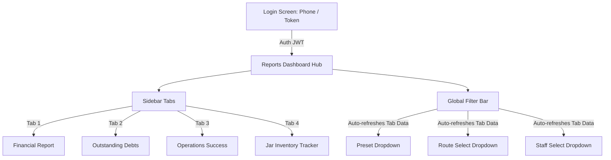

# Camper Vendor Reporting: Frontend Integration & UI/UX Guide

This document provides complete instructions for the frontend development team to connect, validate, and render the vendor reporting dashboard. All APIs are private and require vendor owner credentials.

---

## 🔒 Authentication & Headers
All requests must include a valid JSON Web Token (JWT) belonging to a user with the `'owner'` role in the HTTP Header:
```http
Authorization: Bearer <your_jwt_token_here>
Content-Type: application/json
```

---

## 📅 Date Presets & Custom Ranges
For all temporal reports (`financials`, `operations`, and `inventory`), you must pass a valid `rangePreset` query parameter.

### Available Preset Options:
*   `7_days`: Current date minus 6 days, up to the end of today.
*   `last_week`: Previous full calendar week (Monday `00:00:00` to Sunday `23:59:59`).
*   `15_days`: Current date minus 14 days, up to the end of today.
*   `30_days`: Current date minus 29 days, up to the end of today.
*   `last_month`: Previous calendar month (e.g., if today is August 20th, it covers July 1st to July 31st).
*   `3_months`: Current date minus 3 calendar months, up to the end of today.
*   `custom`: Allows inputting explicit date boundaries using `from` and `to`.

> [!WARNING]
> **Custom Date Boundaries:**
> When using `rangePreset=custom`, the `from` and `to` query parameters are **required** and must be in ISO Date format (`YYYY-MM-DD`). 
> The date span between `from` and `to` **cannot exceed 90 days** due to query performance restrictions. If it does, the server returns a `400 Bad Request` error.

---

## 🗺️ Shared Query Filters
All endpoints (except where noted) support optional filtering:
*   `routeId` (UUID): Filters records belonging to a specific delivery route.
*   `staffId` (UUID): Filters records logged/assigned to a specific delivery staff member.

---

## 🛠️ Endpoints Reference

### 1. Financial Summary Report
*   **Path**: `GET /api/vendor/reports/financials`
*   **Filters Supported**: `rangePreset`, `from`, `to`, `routeId`, `staffId`

#### Response JSON:
```json
{
  "success": true,
  "data": {
    "period": {
      "from": "2026-07-20T18:30:00.000Z",
      "to": "2026-08-19T18:29:59.999Z"
    },
    "totalRevenue": 8955.00,
    "totalCollections": 6572.00,
    "collectionsByMode": {
      "cash": 6277.00,
      "bank_transfer": 250.00,
      "upi": 45.00
    }
  }
}
```

#### UI Rendering Recommendations:
1.  **KPI Highlight Cards**:
    *   **Billed Revenue**: Display `totalRevenue` prominently in a success color (e.g. green).
    *   **Payments Collected**: Display `totalCollections` prominently (e.g. indigo/purple).
2.  **Collection Efficiency Bar**:
    *   Calculate: `Efficiency % = Math.min(100, Math.round((totalCollections / totalRevenue) * 100))`
    *   Render as a horizontal progress bar. An efficiency of >80% is good, below 50% should show a warning color.
3.  **Collections Breakdown**:
    *   Render a table or pie chart of `collectionsByMode` to show where the cash flow originates (Cash vs UPI vs Bank Transfer).

---

### 2. Outstanding Balances Report
*   **Path**: `GET /api/vendor/reports/outstanding`
*   **Filters Supported**: `routeId`, `staffId` *(No date presets applicable; returns current ledger debt).*

#### Response JSON:
```json
{
  "success": true,
  "data": [
    {
      "id": "484f953e-3e5b-407d-8d53-9524b298067b",
      "name": "User1",
      "phone": "+919876543210",
      "address": "123, Ring Road, Sector A",
      "currentBalance": "1525.00",
      "Route": {
        "name": "Indraprastha"
      }
    }
  ]
}
```

#### UI Rendering Recommendations:
1.  **Debt Table**:
    *   List customers with names, phones, and addresses.
    *   Display route name in a badge.
    *   Show `currentBalance` in **red** or bold text to signify pending receivable debt.
2.  **Filter Interaction**:
    *   Provide dropdown filters for Routes and Staff. When selected, the UI should immediately reload the list to isolate which customers owe money on a specific driver's route.

---

### 3. Operational & Performance Report
*   **Path**: `GET /api/vendor/reports/operations`
*   **Filters Supported**: `rangePreset`, `from`, `to`, `routeId`, `staffId`

#### Response JSON:
```json
{
  "success": true,
  "data": {
    "period": {
      "from": "2026-07-20T18:30:00.000Z",
      "to": "2026-08-19T18:29:59.999Z"
    },
    "summary": {
      "totalScheduled": 205,
      "totalCompleted": 185,
      "totalSkipped": 20,
      "totalDeliveredJars": 420,
      "totalReturnedJars": 380,
      "successRate": 90
    },
    "byRoute": [
      {
        "routeId": "6063b516-d3c4-4e7d-b4cd-4fc608357701",
        "routeName": "Indraprastha",
        "total": 120,
        "completed": 110,
        "skipped": 10,
        "delivered": 250,
        "returned": 230
      }
    ],
    "byStaff": [
      {
        "staffId": "e140c216-9667-450d-b66f-022c40b482aa",
        "staffName": "Staff Driver 1",
        "total": 90,
        "completed": 85,
        "skipped": 5,
        "delivered": 180,
        "returned": 160
      }
    ]
  }
}
```

#### UI Rendering Recommendations:
1.  **Summary Dashboard Grid**:
    *   Show **Trips Scheduled** (`totalScheduled`).
    *   Show **Completed Deliveries** (`totalCompleted`) with a checkmark.
    *   Show **Skipped Trips** (`totalSkipped`) in yellow/red to highlight service delays.
    *   Show **Success Rate** (`successRate`) with a radial progress ring or gauge.
2.  **Route & Staff Leaderboards**:
    *   Render lists of Routes and Staff with completion success rates.
    *   Highlight top-performing staff members and identify routes with high skip rates.

---

### 4. Container & Jar Inventory Tracker
*   **Path**: `GET /api/vendor/reports/inventory`
*   **Filters Supported**: `rangePreset`, `from`, `to`, `routeId`, `staffId`

#### Response JSON:
```json
{
  "success": true,
  "data": {
    "period": {
      "from": "2026-07-20T18:30:00.000Z",
      "to": "2026-08-19T18:29:59.999Z"
    },
    "inventory": [
      {
        "customerId": "9fb5266d-f9be-4353-8c09-d064b6e73f05",
        "customerName": "Abhi Shek",
        "customerPhone": "+917247738530",
        "routeName": "Indraprastha",
        "staffName": "Gopal",
        "deliveredInRange": 10,
        "returnedInRange": 9,
        "netChangeInRange": 1,
        "cumulativeOutstanding": 5
      }
    ]
  }
}
```

#### UI Rendering Recommendations:
1.  **Outstanding Bottles Indicator**:
    *   The `cumulativeOutstanding` represents the total number of empty cans/jars currently left with the client.
    *   If `cumulativeOutstanding` is high, color it yellow/red to alert drivers to collect empty cans during their next trip.
2.  **Net Change Column**:
    *   `netChangeInRange` shows the flow during the selected window. If positive (e.g. `+2`), more full jars were delivered than empty ones returned. If negative (e.g. `-3`), the client returned more empties than they received. Use colored text (+ is red/warning, - is green/returned).

---

## 🎨 UI/UX Flow & Component Mappings
Below is the system mapping showing the recommended dashboard flow:



### Dynamic Dropdown Population
On initial page load, you must query the metadata endpoints to populate the filter selectors:
*   **Populate Routes**: Retrieve from `GET /api/vendor/routes` (use `id` as option value, `name` as display).
*   **Populate Staff**: Retrieve from `GET /api/vendor/staff` (use `id` as option value, `name` as display).
*   **Vendor Header details**: Retrieve from `GET /api/vendor/profile` to get the business name and owner details.
*   **General Dashboard counts**: Retrieve from `GET /api/vendor/dashboard` to populate general metrics on top.

---

## ⚠️ Error & State Handling Guidelines

### 1. Handling Range Error (400 Bad Request)
When validation throws an error (such as custom date range exceeding 90 days):
*   **Visual**: Intercept the 400 error message and show a user-friendly error banner or toast. Do not display raw JSON error logs to non-developers.
*   **Validation Rule**: Validate on the client side: `moment(to).diff(moment(from), 'days') <= 90` to block requests before hitting the server.

### 2. Empty States
If the data array is empty (`data: []` or metrics are zero):
*   Avoid blank pages. Render a custom graphic (e.g., a checklist icon or calendar icon) with helper text like: *"No delivery actions or transaction entries recorded in the selected date range. Try choosing a larger date preset."*

---

## 📋 Code Symbol Mappings (Backend References)
For adjustments or deeper understanding of query logic, refer to:
*   **Validation Schema**: [`src/validations/report.validation.js`](file:///d:/compunic/Campar_project/Camper_backend/src/validations/report.validation.js)
*   **Routing Definition**: [`src/routes/report.routes.js`](file:///d:/compunic/Campar_project/Camper_backend/src/routes/report.routes.js)
*   **Controller Resolvers**: [`src/controllers/report.controller.js`](file:///d:/compunic/Campar_project/Camper_backend/src/controllers/report.controller.js)
*   **Sequelize Database Aggregations**: [`src/services/report.service.js`](file:///d:/compunic/Campar_project/Camper_backend/src/services/report.service.js)
